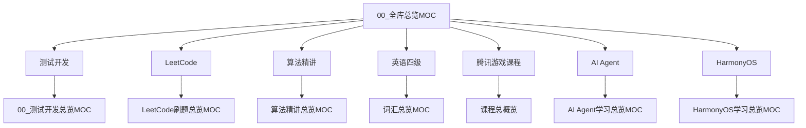

# 全库总览 MOC

## 学习主线

1. [[00_测试开发总览MOC]]
2. [[LeetCode刷题总览MOC]]
3. [[算法精讲总览MOC]]
4. [[词汇总览MOC]]
5. [[课程总概览]]
6. [[AI Agent学习总览MOC]]
7. [[HarmonyOS学习总览MOC]]

## 关系桥接

- 测试开发主线：[[00_测试开发总览MOC]]
- 算法刷题主线：[[LeetCode刷题总览MOC]]
- 算法精讲补充：[[算法精讲总览MOC]]
- 英语复习入口：[[词汇总览MOC]]
- AI 学习入口：[[AI Agent学习总览MOC]]
- HarmonyOS 学习入口：[[HarmonyOS学习总览MOC]]

## 图谱导航

## 工具与同步

- 协作规则：[[AI操作规则]]
- 笔记同步：[[Git操作_三端笔记共享使用方法]]
