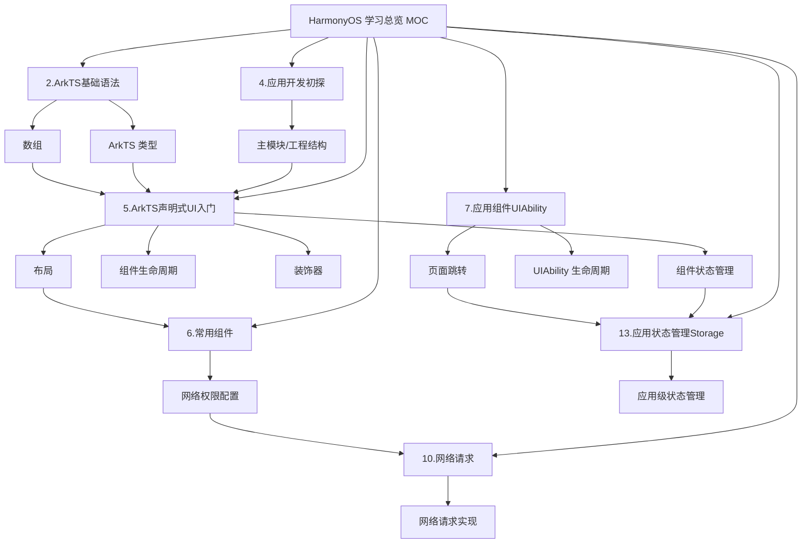

# HarmonyOS 学习总览 MOC

## 速查入口

- 主模块/工程入口：[[4.HarmonyOS应用开发初探]]
  重点看 `src > main > ets`、`entryability`、`pages` 这一段，说明了主模块代码放在哪里。
- ArkTS 类型总览：[[2.ArkTS基础语法#ArkTS]]
- ArkTS 数组：[[2.ArkTS基础语法#数组]]
- 布局总入口：[[5.ArkTS声明式UI入门#线性布局（Row/Column）]]
- 常见布局补充：[[5.ArkTS声明式UI入门#层叠布局（Stack）]]、[[5.ArkTS声明式UI入门#弹性布局（Flex）]]、[[5.ArkTS声明式UI入门#相对布局（RelativeContainer）]]、[[5.ArkTS声明式UI入门#栅格布局（GridRow/GridCol）]]
- 页面跳转方法：[[7.应用组件UIAbility#UIAbility内页面的跳转和数据传递]]、[[7.应用组件UIAbility#路由]]
- 配置网络权限：[[6.常用组件#Web组件]]、[[5.ArkTS声明式UI入门#网络图片]]、[[10.网络请求]]
- 组件生命周期：[[5.ArkTS声明式UI入门#页面和自定义组件生命周期]]、[[7.应用组件UIAbility#UIAbility的生命周期]]
- 装饰器：[[4.HarmonyOS应用开发初探]]、[[5.ArkTS声明式UI入门#方式1：@Component装饰器进行自定义组件抽取]]、[[5.ArkTS声明式UI入门#方式2：@Builder装饰器进行自定义构建函数]]、[[5.ArkTS声明式UI入门#@Extend装饰器：自定义扩展组件样式]]
- 状态管理：[[5.ArkTS声明式UI入门#组件状态管理]]、[[13.应用状态管理Storage]]

## 知识点对应关系

- 工程结构先看：[[4.HarmonyOS应用开发初探]]
- 写 UI 和布局时主看：[[5.ArkTS声明式UI入门]]
- 需要页面路由和 Ability 生命周期时主看：[[7.应用组件UIAbility]]
- 需要网络请求与联网能力时串联：[[6.常用组件]] + [[10.网络请求]]
- 需要组件内状态与跨页面状态时串联：[[5.ArkTS声明式UI入门]] + [[13.应用状态管理Storage]]

## 关系图谱

## 建议学习顺序

1. 先看 [[4.HarmonyOS应用开发初探]]，建立工程结构和主模块位置。
2. 再看 [[2.ArkTS基础语法]]，先补齐 ArkTS 类型、数组这些语法底座。
3. 然后进入 [[5.ArkTS声明式UI入门]]，集中掌握布局、装饰器、组件生命周期、组件内状态管理。
4. 页面切换和 Ability 概念放到 [[7.应用组件UIAbility]]。
5. 网络部分按 [[6.常用组件]] -> [[10.网络请求]] 的顺序看。
6. 最后用 [[13.应用状态管理Storage]] 补应用级状态共享。

## 返回总览

- [[00_全库总览MOC]]
