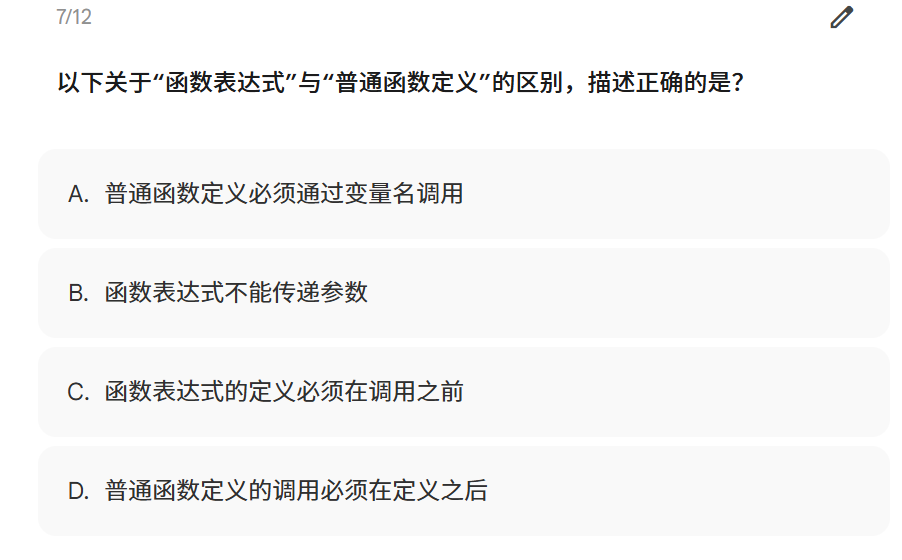

# 函数表达式与普通函数定义的区别

## 原题



> 以下关于“函数表达式”与“普通函数定义”的区别，描述正确的是？
>
> A. 普通函数定义必须通过变量名调用  
> B. 函数表达式不能传递参数  
> C. 函数表达式的定义必须在调用之前  
> D. 普通函数定义的调用必须在定义之后

## 正确答案

**C. 函数表达式的定义必须在调用之前。**

更准确地说：使用 `var` 声明的函数表达式，必须在完成赋值之后才能调用；使用 `let` 或 `const` 声明时，也必须先执行声明和初始化，再调用函数。

---

## 每个选项逐项分析

### A. 普通函数定义必须通过变量名调用：错误

普通函数定义一般指**函数声明**：

```js
function add(a, b) {
  return a + b;
}

add(1, 2);
```

这里通过函数名 `add` 调用，而不是必须通过某个变量名调用。函数声明中的 `add` 是函数的标识符。

函数还可以作为值传递给其他变量：

```js
function add(a, b) {
  return a + b;
}

const calculate = add;
calculate(1, 2);
```

因此，函数声明既可以直接通过函数名调用，也可以先把函数对象赋给变量，再通过变量调用。“必须通过变量名调用”的说法过于绝对。

### B. 函数表达式不能传递参数：错误

函数表达式当然可以定义形参，也可以在调用时传递实参：

```js
const add = function (a, b) {
  return a + b;
};

console.log(add(1, 2)); // 3
```

- `a`、`b` 是**形参**：定义函数时用于接收数据。
- `1`、`2` 是**实参**：调用函数时真正传入的数据。

函数能否传参，与它是“函数声明”还是“函数表达式”没有关系。

### C. 函数表达式的定义必须在调用之前：正确

函数表达式是先创建一个函数，再把这个函数赋值给变量：

```js
const add = function (a, b) {
  return a + b;
};

add(1, 2);
```

在执行赋值语句以前，变量中还没有保存这个可调用的函数，因此不能提前调用：

```js
add(1, 2); // ReferenceError

const add = function (a, b) {
  return a + b;
};
```

`const add` 处于暂时性死区，在声明初始化前访问会抛出 `ReferenceError`。

如果使用 `var`，虽然变量声明会提升，但函数赋值不会提升：

```js
add(1, 2); // TypeError: add is not a function

var add = function (a, b) {
  return a + b;
};
```

代码执行前可以近似理解为：

```js
var add;       // 只提升变量声明，初始值是 undefined
add(1, 2);     // 相当于 undefined(1, 2)，因此报 TypeError
add = function (a, b) {
  return a + b;
};
```

所以考试中应记住：**函数表达式不能在赋值完成前调用。**

### D. 普通函数定义的调用必须在定义之后：错误

普通函数定义，也就是函数声明，会发生**函数声明提升**。因此，在同一作用域中，通常可以先调用，后定义：

```js
console.log(add(1, 2)); // 3

function add(a, b) {
  return a + b;
}
```

JavaScript 在进入当前作用域时，会先创建完整的函数绑定，所以执行第一行代码时，`add` 已经可以调用。

因此，“必须在定义之后调用”是错误的。

---

## 核心知识点：函数声明与函数表达式

### 1. 函数声明

语法：

```js
function 函数名(形参) {
  函数体
}
```

特点：

- 必须有函数名。
- 会发生完整的函数声明提升。
- 在同一作用域中通常可以先调用、后定义。

### 2. 函数表达式

语法：

```js
const 变量名 = function (形参) {
  函数体
};
```

特点：

- 函数被当作一个值，赋给变量。
- `function` 后面的函数名可以省略，此时是匿名函数表达式。
- 变量的声明规则由 `var`、`let` 或 `const` 决定。
- 赋值操作不会提升，所以必须在赋值完成后调用。

### 3. 两者最关键的区别

```js
sayHello(); // 可以调用

function sayHello() {
  console.log("hello");
}
```

```js
sayHello(); // 不可以调用

const sayHello = function () {
  console.log("hello");
};
```

一句话记忆：

> **函数声明整体提升；函数表达式只按变量规则处理，函数赋值不会提升。**

---

## “提升”到底提升了什么

提升并不是源代码真的被移动到了文件顶部，而是 JavaScript 在执行代码前，会先为当前作用域中的声明创建绑定。

### 函数声明

函数名和完整函数体都会提前可用：

```js
test(); // 正常执行

function test() {
  console.log("test");
}
```

### `var` 函数表达式

只提前创建变量，并初始化为 `undefined`：

```js
test(); // TypeError

var test = function () {
  console.log("test");
};
```

### `let`、`const` 函数表达式

变量绑定已创建，但在执行声明前不能访问，这段区域称为**暂时性死区（TDZ）**：

```js
test(); // ReferenceError

const test = function () {
  console.log("test");
};
```

---

## 易错点

### 易错点 1：函数表达式不是一种特殊的调用方式

两种函数最终都使用 `()` 调用：

```js
function fn1() {}
const fn2 = function () {};

fn1();
fn2();
```

区别主要发生在**创建方式和提升行为**上。

### 易错点 2：匿名函数不等于函数表达式

匿名函数通常作为表达式使用：

```js
const fn = function () {};
```

函数表达式也可以有自己的内部名称：

```js
const fn = function inner() {
  console.log(inner.name);
};
```

`inner` 主要在函数内部可见，可用于递归或调试；外部仍然通过 `fn()` 调用。

### 易错点 3：箭头函数也是函数表达式

```js
const add = (a, b) => a + b;
```

箭头函数同样要等赋值完成后才能调用，不会像函数声明那样整体提升。

### 易错点 4：“定义之前”应理解为“完成初始化之前”

题目中的 C 是考试语境下的正确表述。严格来说，关键不是书写位置本身，而是程序执行到调用语句时，保存函数的变量是否已经完成初始化和赋值。

---

## 对比表

| 对比项 | 函数声明 | 函数表达式 |
| --- | --- | --- |
| 示例 | `function fn() {}` | `const fn = function () {};` |
| 是否可以传参 | 可以 | 可以 |
| 是否可以返回值 | 可以 | 可以 |
| 能否作为值传递 | 可以 | 可以 |
| 提升内容 | 函数名和完整函数体 | 只按变量声明规则处理 |
| 能否在代码书写位置之前调用 | 通常可以 | 不可以 |
| 常见用途 | 定义普通具名函数 | 回调函数、赋值、动态选择函数 |

## 考试速记

1. 看到 `function fn() {}`：这是**函数声明**，通常可以先调用后定义。
2. 看到 `const fn = function () {}`：这是**函数表达式**，必须先赋值后调用。
3. 两者都能传参、返回值，也都能作为值传递。
4. `var` 提前调用通常报 `TypeError`；`let`、`const` 提前访问通常报 `ReferenceError`。

