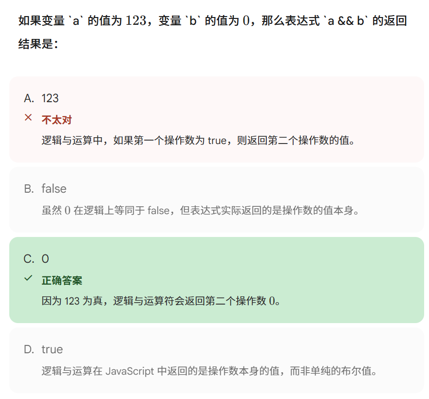

你选择的答案错误，是因为你忽略了逻辑运算符的**“短路效果”**。

在 JavaScript 中，逻辑运算符 `||`（或）和 `&&`（与）在执行时都有一个特性：**如果仅靠左边的表达式就能确定整个结果，那么右边的代码根本就不会被执行**。

详细解释：

1. **代码分析**：`true || num++;`
2. **||** **的逻辑**：只要左右两边有一个为 `true`，整个结果就是 `true`。
3. **短路发生**：当浏览器执行到这一行时，发现左边已经是 `true` 了。此时，无论右边的 `num++` 是什么，整个表达式的结果肯定都是 `true`。
4. **结果**：为了提高效率，浏览器会直接**跳过**右边的 `num++`。
5. **变量值**：既然 `num++` 根本没有运行，变量 `num` 的值自然就维持原样，还是 **1**。

归纳：

- **true || ...**：发生短路，右边不执行。
- **false && ...**：也会发生短路，因为左边为 `false` 时，整个结果必为 `false`，右边也会被跳过。

你选择的答案之所以错误，是因为你记混了 **&&****（逻辑与）** 的返回规则。

在 JavaScript 中，逻辑运算符不仅返回布尔值，还会返回操作数本身的值。根据材料中的定义，`&&` 的执行逻辑如下：

1. `&&`（逻辑与）的返回规则

- **规则**：如果第一个操作数（a）的值为 `true`（或真值），则返回第二个操作数（b）的值；如果第一个操作数（a）的值为 `false`（或假值），则返回第一个操作数（a）的值。
- **你的情况**：
    - `a = 123`：在 JavaScript 中，非零数字会被视为 **“真值（truthy）”**。
    - 因此，`a` 为 `true`，根据规则，表达式会直接返回 **b** **的值**。
    - 由于 `b = 0`，所以最终结果是 **0**。

2. 为什么你选了 123？

你可能把 `&&` 和 **||****（逻辑或）** 的规则搞反了：

- **||** **的规则**：如果第一个值为 `true`，则直接返回第一个值。
- 如果题目是 `123 || 0`，结果才会是你选择的 `123`。

总结

你可以把 `&&` 想象成一个“找假”的过程：它会一直往后找，直到遇到第一个假值并返回它；如果全是真值，就返回最后一个。

#### 进阶
1. 优先级陷阱

代码：`var res = 0 || 1 && 2;`

- **结果**：`2`
- **解析**：在 JavaScript 中，**&&** **的优先级高于** **||**。
    - 程序先算 `1 && 2`：因为 `1` 为真，所以返回第二个值 `2`。
    - 再算 `0 || 2`：因为 `0` 为假，所以返回第二个值 `2`。

2. 短路与真假值结合

代码：`var res = "hello" && 0 || "world";`

- **结果**：`"world"`
- **解析**：
    - 先看左半部分 `"hello" && 0`：字符串 `"hello"` 是非空字符串（真值），所以 `&&` 返回第二个操作数 `0`。
    - 现在表达式变成了 `0 || "world"`。
    - 因为 `0` 是假值，`||` 运算符会跳过它，返回第二个操作数 **"world"**。

考点总结：

1. **优先级**：`!` > `&&` > `||`。
2. **真假值转换**：在逻辑运算中，`0`、`""`（空字符串）、`null`、`undefined`、`NaN` 都会被当做 `false` 处理。
3. **返回结果**：逻辑运算符不一定返回 `true/false`，它们会返回触发“结果确定”的那个**操作数本身**。

