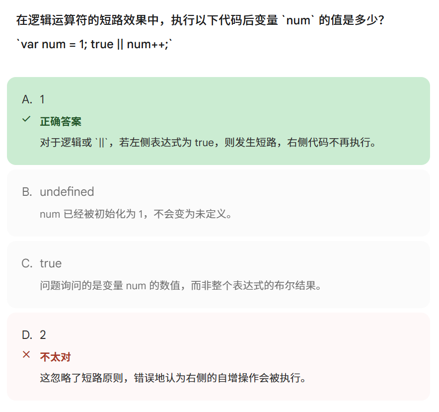

你选择的答案错误，是因为你忽略了逻辑运算符的**“短路效果”**。

在 JavaScript 中，逻辑运算符 `||`（或）和 `&&`（与）在执行时都有一个特性：**如果仅靠左边的表达式就能确定整个结果，那么右边的代码根本就不会被执行**。

详细解释：

1. **代码分析**：`true || num++;`
2. **||** **的逻辑**：只要左右两边有一个为 `true`，整个结果就是 `true`。
3. **短路发生**：当浏览器执行到这一行时，发现左边已经是 `true` 了。此时，无论右边的 `num++` 是什么，整个表达式的结果肯定都是 `true`。
4. **结果**：为了提高效率，浏览器会直接**跳过**右边的 `num++`。
5. **变量值**：既然 `num++` 根本没有运行，变量 `num` 的值自然就维持原样，还是 **1**。

归纳：

- **true || ...**：发生短路，右边不执行。
- **false && ...**：也会发生短路，因为左边为 `false` 时，整个结果必为 `false`，右边也会被跳过。

