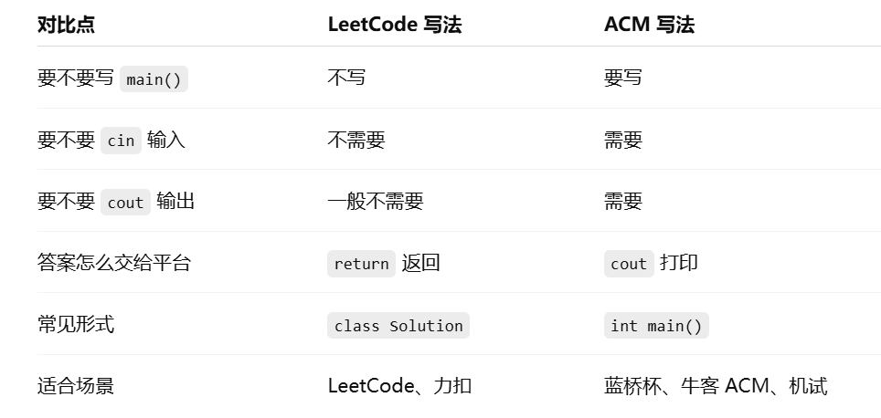

## 最适合你的组合

```TXT
日常主刷：LeetCode Hot 100国内笔试：牛客输入输出 + 面试 TOP101面试高频：CodeTop知识点补课：AcWing
```

你现在最该做的是：

```TXT
每天 LeetCode 2 道每周牛客输入输出 2 次Hot 100 刷到 60 道后开始 CodeTop不会的知识点再去 AcWing 补
```

一句话：**你主刷力扣，别乱跳平台；牛客练国内笔试输入输出；CodeTop后期查大厂高频；AcWing只用来补基础。**

## 刷题路径

### 总原则

- 不建议直接按 Hot100 原顺序刷。
- 也不建议单纯按“简单 -> 中等 -> 困难”刷。
- 最适合你的方式：**按专题刷，用 Hot100 当题库；每个专题内部再按简单 -> 中等 -> 偏难刷。**

### 你现在最适合的顺序

1. 数组 / 哈希
2. 双指针
3. 滑动窗口
4. 前缀和
5. 栈 / 单调栈
6. 链表
7. 二叉树
8. 二分查找
9. 回溯
10. 堆 / 优先队列
11. 贪心
12. 动态规划
13. 图

### 第一轮建议刷法

- 每个专题先做 2~3 道简单题，把模板做熟。
- 再做 5~8 道中等题，练成“看到题能想到解法”。
- 暂时不要死磕难题，优先把中等题刷顺。
- 每做完一个专题，回头复盘一次错题和模板。

### 你现在可以直接这样刷

#### 第一阶段：先打基础

1. 数组 / 哈希
   - 两数之和
   - 字母异位词分组
   - 最长连续序列
2. 双指针
   - 移动零
   - 盛最多水的容器
   - 三数之和
3. 滑动窗口
   - 无重复字符的最长子串
   - 找到字符串中所有字母异位词
   - 最小覆盖子串
4. 前缀和
   - 和为 K 的子数组
   - 除自身以外数组的乘积

#### 第二阶段：进入中频核心题型

5. 栈 / 单调栈
   - 有效的括号
   - 每日温度
   - 柱状图中最大的矩形
6. 链表
   - 反转链表
   - 环形链表
   - 合并两个有序链表
7. 二叉树
   - 二叉树的前序遍历
   - 二叉树的层序遍历
   - 二叉树的最大深度
8. 二分查找
   - 搜索插入位置
   - 搜索二维矩阵
   - 在旋转排序数组中搜索

#### 第三阶段：面试拉分题型

9. 回溯
   - 全排列
   - 子集
   - 组合总和
10. 堆 / 优先队列
   - 数组中的第 K 个最大元素
   - 前 K 个高频元素
11. 贪心
   - 跳跃游戏
   - 划分字母区间
12. 动态规划
   - 爬楼梯
   - 打家劫舍
   - 最长递增子序列
13. 图
   - 岛屿数量
   - 课程表

### 一句话执行版

**先按专题刷，不按原顺序乱跳；先吃透数组、哈希、双指针、滑动窗口，再进树、回溯、DP。**

leetcode ACM区别

