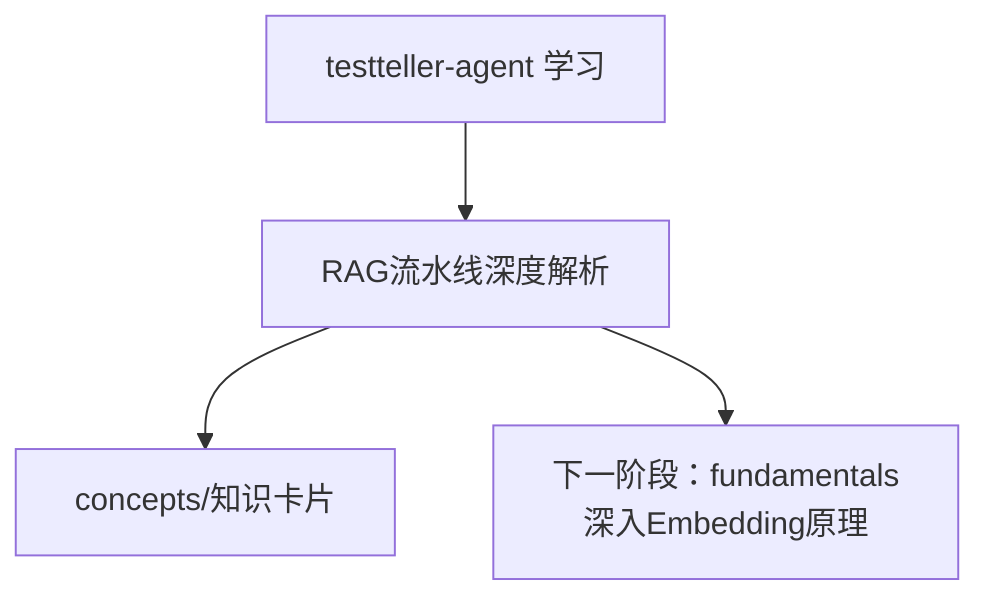

# testteller-agent 学习总览

## 学习目标
理解 testteller-agent 双索引混合检索 RAG 流水线的各环节串联、设计取舍和代码实现

## 模块图

## 模块索引

| 顺序 | 模块 | 状态 | 笔记 | 完成日期 |
|---|---|---|---|---|
| 01 | RAG流水线深度解析 | ✅ 已完成 | [[notes/RAG流水线深度解析]] | 2026-07-22 |
| 知识卡片 | RAG流水线总览 | 已完成 | [[concepts/RAG流水线总览]] | 2026-07-19 |
| 知识卡片 | retrieval_patterns正则引擎 | 已完成 | [[concepts/retrieval_patterns_正则引擎详解]] | 2026-07-19 |
| 知识卡片 | QueryAnalyzer规则查询分析 | 已完成 | [[concepts/QueryAnalyzer_规则查询分析]] | 2026-07-19 |
| 知识卡片 | LocalIndex本地确定性索引 | 已完成 | [[concepts/LocalIndex_本地确定性索引]] | 2026-07-19 |
