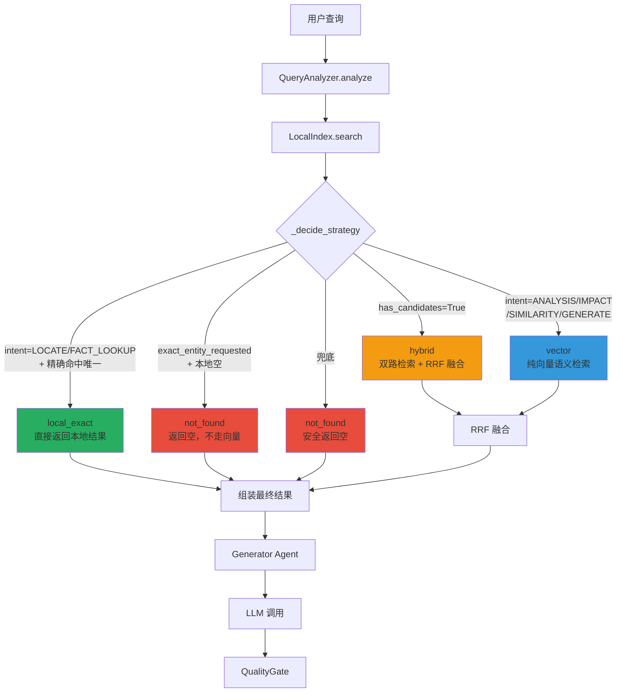
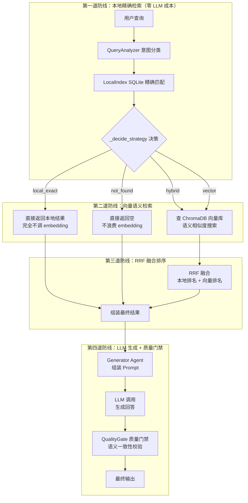
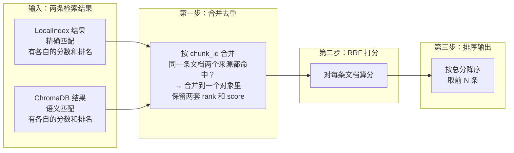
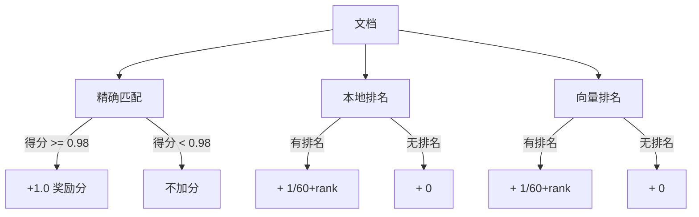

# testteller-agent RAG 流水线深度解析

## 模块目标
深入理解 testteller-agent 从查询输入 → 检索 → 策略路由 → Prompt 组装 → LLM 调用 → 质量门禁的完整 RAG 流水线，重点掌握双索引混合检索架构的设计取舍。

## 对话记录

### 01｜主线：RAG流水线总览

#### 我的疑惑
刚开始接触该项目，想知道 RAG 流水线如何串联。猜测 QueryAnalyzer 是通过 LLM 做语义分析来分类意图。

#### AI 的提问
观察架构图，猜 QueryAnalyzer 是如何判断用本地索引精确查找还是向量搜索语义匹配的？是否需要调用 LLM？

#### 我的回答
通过 LLM 的语义分析然后输出，接着根据 RAG 的向量检索进行判断。

#### AI 的反馈与纠正
完全相反。QueryAnalyzer 是纯规则引擎（Zero LLM），通过 if-elif 关键词匹配做意图分类，正则做信息提取。作者在代码注释中写明："Rule-based analyzer. Ambiguous Chinese questions deliberately fall back to vectors."

#### 最终理解
QueryAnalyzer 的 _classify_intent 就是"if '生成' in query → GENERATE"这种级别。提取信息也是正则（HTTP_METHOD_PATTERN、TEST_ID_PATTERN 等）。零 LLM 调用，微秒级。

#### 代码或证据
`testteller/core/retrieval/query_analyzer.py:L39-L50` — _classify_intent 方法

---
```python
def _classify_intent(self, lowered: str) -> QueryIntent:
        if any(word in lowered for word in self._GENERATE_WORDS):#40
            return QueryIntent.GENERATE#41
        if any(word in lowered for word in self._IMPACT_WORDS):#42
            return QueryIntent.IMPACT#43
        if any(word in lowered for word in self._SIMILAR_WORDS):#44
            return QueryIntent.SIMILARITY#45
        if any(word in lowered for word in self._ANALYSIS_WORDS):#46
            return QueryIntent.ANALYSIS#47
        if any(word in lowered for word in self._LOCATE_WORDS):#48
            return QueryIntent.LOCATE#49
        return QueryIntent.FACT_LOOKUP#50
```
### 02｜插问：query_analyzer.py L39-L50 的代码意义

#### 插问内容
这段 _classify_intent 的代码每一行在做什么？

#### AI 的回答
这段代码是一个 if-elif 优先级链：
- L40：匹配 GENERATE 关键词 → "生成"、"测试用例"、"test case"
- L42：匹配 IMPACT 关键词 → "影响"、"调用链"
- L44：匹配 SIMILARITY 关键词 → "类似"、"相似"
- L46：匹配 ANALYSIS 关键词 → "风险"、"边界"、"分析"
- L48：匹配 LOCATE 关键词 → "在哪里"、"定位"
- L50：兜底返回 FACT_LOOKUP

顺序敏感、互斥、零 AI 成本。`_decide_strategy` 用这个意图值决定检索策略。

#### 与主线的关系
这是插问，详细解释了 _classify_intent 的每一行代码逻辑。

#### 对主线的影响
无影响，加深对意图分类器的理解。

---

### 03｜主线：FACT_LOOKUP 到 LLM 的调用链

#### 我的疑惑
到 FACT_LOOKUP（兜底）这一步就开始进行 LLM 的调用了吗？

#### AI 的提问
待补充

#### 我的回答
待补充

#### AI 的反馈与纠正
不，FACT_LOOKUP 只是决定了检索策略。整个检索层（QueryAnalyzer → HybridRetriever → LocalIndex/ChromaDB）全程不调 LLM。LLM 是在 Generator Agent 中，检索结果被填入 Prompt 的 {context} 之后才调用的。

#### 最终理解
检索层零 LLM → 拿到文档 → 填入 Prompt → 才调 LLM。Generator Agent 的 `generate_test_cases` 方法里调用 `llm_manager.generate_text_async(prompt)` 才是真正调 LLM 的地方。

#### 代码或证据
`testteller/generator_agent/agent/testteller_agent.py:L302-L354` — generate_test_cases 方法

---

### 04｜主线：检索为空不卡死

#### 我的疑惑
如果检索出来的文档太少不足以生成完整 Prompt，会不会卡住？

#### AI 的提问
待补充

#### 我的回答
待补充

#### AI 的反馈与纠正
不会。三个防御层：
1. CLI 入口预检集合是否为空，空则提示用户是否继续
2. 检索结果为空时 context 就是空字符串，依然发给 LLM
3. 质量门禁兜底：`_calculate_quality_score` 检查 TODO、步骤数、长度、Expected Result

偏好是"宁愿给次优结果也不让系统崩溃"。

#### 最终理解
检索零命中 → Prompt 只有 query → LLM 全靠通用知识硬编。质量差但不会崩。后续有 QualityGate 做双重评分（确定性规则 + AI 语义评审）。

#### 代码或证据
待补充

---

### 05｜主线：LOCATE + not_found 边界情况

#### 我的疑惑
待补充

#### AI 的提问
当用户查 "E2E_LOGIN_001 在哪里" 但本地索引没有时，系统直接返回 not_found，不走向量搜索。这个设计合理吗？

#### 我的回答
合理。因为精确查找没命中 → not_found。如果这时候走向量检索，返回的是一堆不相干的片段，组装成劣质 Prompt，LLM 花更多 token 生成低质量结果，质量门禁又花钱打回，白忙一场。提前切断比事后补救便宜得多。

#### AI 的反馈与纠正
分析完全正确，和作者的设计意图一致。这笔账算得很清楚。

#### 最终理解
`_decide_strategy` 第三分支：`exact_entity_requested=True` 且 `intent in {LOCATE, FACT_LOOKUP}` 但本地没找到 → not_found。用户指名道姓找精确 ID，精确索引说没有，那就是没有。不走向量搜索碰运气。

#### 代码或证据
`testteller/core/retrieval/hybrid_retriever.py:L51-L52` — not_found 分支

---

### 06｜主线：进入 diagnosis 阶段

#### 我的疑惑
待补充

#### AI 的提问
要不要进入下一阶段？（diagnosis：用具体查询测试理解，诊断盲区）

#### 我的回答
进入 diagnosis。

#### AI 的反馈与纠正
验证 evidence 通过，TRANSITION_APPROVED diagnosis。提出诊断测试题：

查询 1: "生成登录模块的测试用例" — 需要预测意图、提取信息、检索策略等。

#### 最终理解
用户同意进入 diagnosis，但随后要求先回到代码做完整复习再做题。

#### 代码或证据
待补充

---

### 07｜插问：回到代码复习理解

#### 插问内容
刚才没有完整理解代码意义，请求拉回上下文重新学习。

#### AI 的回答
暂停诊断，保存分支，开始按流水线顺序逐模块拉取全部关键代码。

#### 与主线的关系
主线是诊断测试，这个插问是回到上一阶段做代码复习。

#### 对主线的影响
诊断测试暂停，转为代码深度复习。

---

### 08｜主线：全面拉取并逐模块解析

#### 我的疑惑
待补充

#### AI 的提问
待补充

#### 我的回答
待补充

#### AI 的反馈与纠正
按流水线顺序拉取全部核心文件并行阅读：`retrieval_patterns.py`、`models.py`、`query_analyzer.py`、`local_index.py`、`chromadb_manager.py`、`testteller_agent.py`、`result_fusion.py`，并开始逐模块详解。

#### 最终理解
已完成 retrieval_patterns、models、query_analyzer 三个模块的逐行解析。

#### 代码或证据
待补充

---

### 09｜插问：retrieval_patterns.py 各变量含义

#### 插问内容
L5-L19 每一段定义的是什么？变量名含义看不懂。

#### AI 的回答
详细解释了 13 个正则变量的含义，每个的作用、匹配示例和不匹配示例。

| 变量名 | 用途 |
|---|---|
| TEST_ID_PATTERN | 匹配 E2E/INT/TECH/MOCK 开头的测试 ID |
| API_PATH_PATTERN | 匹配 /api/ 开头的 API 路径 |
| HTTP_METHOD_PATTERN | 匹配 GET/POST/PUT 等 HTTP 方法 |
| PYTHON_CLASS_PATTERN | 从代码中提取 Python 类名 |
| PYTHON_FUNCTION_PATTERN | 从代码中提取 Python 函数名 |
| JS_TS_FUNCTION_PATTERN | 从代码中提取 JS/TS 函数/变量名 |
| QUALIFIED_SYMBOL_PATTERN | 提取 a.b.c 格式的全限定符号 |
| DATA_TESTID_PATTERN | 提取前端 data-testid 属性值 |
| ENV_* 三个 | 提取环境变量（分别对应 Python/Node/模板语法） |
| FILE_NAME_PATTERN | 匹配带扩展名的文件名 |
| TOKEN_PATTERN | 通用分词：英文字母词 + 中文多字词 |

#### 与主线的关系
正则引擎是所有检索层模块的基础。

#### 对主线的影响
无影响，加深对正则系统设计的理解。

---

### 10｜插问：正则表达式 TEST_ID_PATTERN 语法

#### 插问内容
正则表达式的语法不懂，看表格不理解为什么。

#### AI 的回答
逐字符拆解 `\b(?:E2E|INT|TECH|MOCK)_[A-Z0-9_]+\b`：
- `\b`：单词边界，防止部分匹配
- `(?:...)`：非捕获组，四选一
- `_`：字面下划线
- `[A-Z0-9_]+`：字符类，大写字母/数字/下划线至少 1 个
- `re.IGNORECASE`：大小写不敏感

用多个正例和反例做测试验证。

#### 与主线的关系
正则语法是理解所有 pattern 的基础。

#### 对主线的影响
无影响，基础语法查漏补缺。

---

### 11｜主线：local_index.py 写入+查询全流程

#### 我的疑惑
待补充

#### AI 的提问
待补充

#### 我的回答
待补充

#### AI 的反馈与纠正
详解 LocalIndex：

**写入时**（add_documents → _build_entry）：
- 用正则从文档原文中提取 test_ids、api_paths、api_methods、keywords、symbols、config_keys
- 写入 local_documents 表存原文 + content_hash（去重）
- 展平为 (term, term_type, chunk_id) 写入 local_terms 表

**查询时**（search）：
- collect() 按优先级分组查询 local_terms 表
- 每种实体类型有不同权重：test_id/api_key=1.00, api_path=0.88, keyword=0.45
- 累加 scores[chunk_id] → 取原文 → 降序排序 → 截取 limit 条
- 返回 LocalSearchResult(items, match_type, unique, exact_entity_requested)

#### 最终理解
LocalIndex 是 ChromaDB 的伴生 SQLite 索引。写入时同步提取实体，查询时精确/部分匹配获得权重分数，为 HybridRetriever 的策略路由提供基础数据。

#### 代码或证据
`testteller/core/retrieval/local_index.py`
`testteller/core/vector_store/chromadb_manager.py:L203-L208` — 写入协同

---

### 12｜主线：用户要求落盘

#### 我的疑惑
待补充

#### AI 的提问
待补充

#### 我的回答
待补充

#### AI 的反馈与纠正
已完成 4 个知识文件落盘到 Obsidian 库，随后发现 `.codebuddy/skills/learning-note-capture/` 已存在，按 skill 协议重新整理为本笔记。

#### 最终理解
本次学习到此为止。下次继续从 chromadb_manager.py → hybrid_retriever.py → result_fusion.py 推进。

#### 代码或证据
待补充

---

<!-- capture-digest: 88bd9763c6e4031aefc276a0a33d544e95b6593b15e823e7b97313a5c74c720e -->

### 13｜主线：ChromaDBManager 向量存储管理器

#### 我的疑惑
ChromaDBManager 是如何管理向量的？它和之前的 LocalIndex 是什么关系？

#### AI 的提问
猜猜 ChromaDBManager 的核心职责是什么？它和 LocalIndex 有什么区别？

#### 我的回答
ChromaDB 是本地向量数据库，负责语义切分分块后存入向量库。LocalIndex 记不太清了。

#### AI 的反馈与纠正
1. 语义切分（chunking）不是 ChromaDBManager 做的，它接收已切分好的文档块。2. LocalIndex 是 SQLite 精确索引，存 test_id、api_path 等结构化实体，用于精确匹配。

#### 最终理解
ChromaDBManager 内部持有 LocalIndex。写入文档时同时写两份：先调 LLM 生成 embedding → 写入 ChromaDB 向量库 → 再同步写入 LocalIndex（SQLite 精确索引）。查询时先走本地 SQL 再看要不要走向量。

#### 代码或证据
ChromaDB 负责语义相似度搜索（慢但模糊精准），LocalIndex 负责精确字段匹配（快但只认结构化字段）。

LocalIndex 与 ChromaDB 对比：

| 对比维度 | LocalIndex (SQLite) | ChromaDB (向量) |
|---|---|---|
| 匹配方式 | 精确匹配（test_id、api_path 等字段） | 语义相似度（余弦距离） |
| 速度 | 极快（毫秒级 SQL 查询） | 慢（需 LLM 生成 embedding） |
| 适用场景 | 搜 E2E_LOGIN_001、GET /api/user | 搜"类似登录失败的场景" |
| 是否需要 LLM | ❌ 不需要 | ✅ 需要 |
| 写入协作 | 作为 ChromaDB 的伴生索引同步写入 | 先写向量，成功后同步写 LocalIndex |

#### 源代码：ChromaDBManager 初始化

来源：`testteller/core/vector_store/chromadb_manager.py:37-60`

```python
    def __init__(
        self,
        llm_manager: LLMManager,
        collection_name: Optional[str] = None,
        persist_directory: Optional[str] = None,
        host: Optional[str] = None,
        port: Optional[int] = None,
        use_remote: Optional[bool] = None
    ):
        """
        Initialize ChromaDB manager with configuration from settings or parameters.

        Args:
            llm_manager: Instance of LLMManager for embeddings
            collection_name: Name of the ChromaDB collection (optional)
            persist_directory: Directory for ChromaDB persistence (optional)
            host: Host for remote ChromaDB (optional)
            port: Port for remote ChromaDB (optional)
            use_remote: Whether to use remote ChromaDB (optional)
        """
        self.llm_manager = llm_manager

        # Get configuration from settings if available, otherwise use defaults/parameters
        try:
```

#### 代码解释
展示 ChromaDBManager 初始化时配置、客户端、embedding 函数和集合创建

### 14｜插问：Python self 关键字

#### 插问内容
在 ChromaDBManager 代码里一直看到 self 的用法，不懂 self 是什么意思。

#### AI 的回答
self 就是「我自己」——它指代当前正在被操作的「这个实例对象」。比喻：类=员工登记表模板，self=当前正在填的那张表。self.xxx = xxx 表示把数据存到这个对象上。

#### 与主线的关系
面向对象编程的基础概念，所有 Python 类方法都需要理解 self。

#### 对主线的影响
无影响，加深了 Python OOP 基础理解。

#### 主线位置
刚讲完 ChromaDBManager 的 __init__ 方法，解释了 self.collection_name、self.client 等属性的绑定。

### 15｜插问：self 练习题：Counter 类

#### 插问内容
AI 出了一道 self 练习题：两个 Counter 实例 a.add(3)、b.add(5)、a.add(2)，问 a.show() 和 b.show() 分别输出什么？

#### AI 的回答
a.show() = 5, b.show() = 5。a 和 b 是独立计数器，self.count 各管各的互不干扰。a.add(3) 只改 a.count = 3，b.add(5) 改 b.count = 5，a.add(2) 再改 a.count = 5。

#### 与主线的关系
self 概念的巩固练习。

#### 对主线的影响
无影响，巩固了 self 的理解。

#### 主线位置
在 ChromaDBManager 学习过程中插入的 self 练习。

### 16｜主线：_decide_strategy 策略路由决策

#### 我的疑惑
hybrid_retriever.py 里的 _decide_strategy 有哪几种策略？分别什么条件下触发？

#### AI 的提问
猜一下三种场景的策略分别是什么：1）精确命中唯一结果 2）本地有几个候选 3）分析类查询本地没命中

#### 我的回答
1）走本地精确查询 2）走向量库 3）LLM 兜底回答

#### AI 的反馈与纠正
1. 完全正确 → local_exact
2. 差一点 → 是 hybrid（混合），同时查本地+向量库，RRF 融合排序
3. 不对 → 是 vector，先走向量检索，检索到的文档组装成 prompt 后才调 LLM，LLM 是最后一道防线

四种策略设计哲学：

| 策略 | 触发条件 | 设计思想 |
|---|---|---|
| **local_exact** | 精确命中唯一结果 | 「省」— 最小成本原则，已经稳了就别画蛇添足 |
| **hybrid** | 本地有候选结果 | 「互补」— 本地候选做保底，向量语义做精排 |
| **not_found** | 查精确实体但本地无 | 「止损」— 宁可少答，不要错答 |
| **vector** | 模糊语义类查询 | 「对路」— 模糊语义问题就该用向量检索 |

#### 最终理解
四种策略：local_exact（精确命中唯一→不调 embedding 直接返回）、hybrid（本地有候选→双路检索+RRF 融合）、not_found（查精确实体但本地无→止损不走向量）、vector（模糊语义→纯向量检索）。LLM 不是第一道防线，是最后一道。

#### 代码或证据
核心设计思想：能用 SQL 解决问题的绝不调 embedding，能用 embedding 解决的绝不调 LLM。

#### 源代码：_decide_strategy 完整代码

来源：`testteller/core/retrieval/hybrid_retriever.py:46-55`
上下文范围：L44-L57

```python
        )

    def _decide_strategy(self, intent: QueryIntent, local_result) -> Tuple[str, Optional[str]]:
        if intent in {QueryIntent.FACT_LOOKUP, QueryIntent.LOCATE} and local_result.match_type == MatchType.EXACT and local_result.unique:
            return "local_exact", None
        if local_result.has_candidates:
            return "hybrid", "multiple_local_candidates" if not local_result.unique else "intent_requires_context"
        if local_result.exact_entity_requested and intent in {QueryIntent.FACT_LOOKUP, QueryIntent.LOCATE}:
            return "not_found", "exact_entity_not_found"
        if intent in {QueryIntent.ANALYSIS, QueryIntent.IMPACT, QueryIntent.SIMILARITY, QueryIntent.GENERATE}:
            return "vector", "no_local_match" if not local_result.has_candidates else None
        return "not_found", "no_local_match"

    def _to_vector_items(self, results: dict) -> list[RetrievalItem]:
```

##### 策略决策树



#### 代码解释
4 个 if-elif 分支和 1 个兜底，对应 5 条执行路径

### 17｜插问：四道防线设计与 not_found 兜底

#### 插问内容
用户要求把整个 RAG 检索流水线画成「通道+防线」的流程图。然后问：not_found 策略直接返回空，那谁来做兜底？

#### AI 的回答
四道防线：①LocalIndex 精确匹配(SQL) ②ChromaDB 向量语义搜索 ③RRF 融合排序 ④LLM 生成+QualityGate 校验。not_found 策略不调用 embedding（节省了向量生成开销），但 LLM 仍会被调用（context=空字符串），质量门禁大概率会拦截生成结果。核心是：宁可少答，不要错答。



#### 与主线的关系
加深对 RAG 流水线层次化设计的理解。

#### 对主线的影响
纠正了「not_found 直接不输出」的误解。

#### 主线位置
在 _decide_strategy 四种策略刚刚讲解完时插入。

### 18｜插问：本地 embedding 模型 vs 云端

#### 插问内容
用户质疑「embedding 很贵」的说法——向量生成不是用本地模型吗？而且有其他免费本地向量化方案吗？效果如何？多少维？

#### AI 的回答
验证代码发现：GEMINI 用 text-embedding-004（云端，按 token 计费），OPENAI 用 text-embedding-3-small（云端），Llama/Ollama 用 llama3.2:1b（本地，2048 维）。确实存在免费本地方案：

| 模型 | 通过 Ollama 拉取 | 输出维度 | 模型大小 | 中文效果 |
|---|---|---|---|---|
| **all-MiniLM-L6-v2** | `all-minilm:33m` | **384 维** | **33MB** | 一般（英文为主） |
| **M3E-base** | `m3e-base` | **768 维** | **110MB** | ✅ 极好 |
| **nomic-embed-text** | `nomic-embed-text` | **768 维** | 274MB | ✅ 不错 |
| **llama3.2:1b**（本项目默认） | `llama3.2:1b` | **2048 维** | ~1.3GB | ✅ 不错 |
| **BGE-M3** | `bge-m3` | **1024 维** | 560MB | 🏆 中文最佳 |
| **text2vec-large-chinese** | `text2vec-large-chinese` | **1024 维** | ~1GB | 🏆 中文最佳 |

本地模型 MTEB 评分只比 OpenAI 差 1-2 个百分点，但在延迟（20-80ms vs 200-500ms）、成本（免费）、隐私上完胜。

#### 与主线的关系
澄清了 embedding 成本的真实情况——取决于 provider 配置。

#### 对主线的影响
纠正了「embedding 一定很贵」的说法。但无论本地免费还是云端计费，设计原则不变：SQL（微秒级）比本地模型推理（毫秒级）快 100-1000 倍。不该用牛刀杀鸡。

#### 主线位置
在解释《四道防线》中 not_found 节约 embedding 成本时，用户提出质疑。

### 19｜主线：RRF 排名融合原理

#### 我的疑惑
result_fusion.py 的代码看不懂，RRF 公式是什么意思？为什么要有 exact_bonus？

#### AI 的提问
exact_bonus = 1.0 的作用是什么？比如本地排名第 1 但分数 0.99 的文档和向量排名第 1 的文档，RRF 算出来谁排前面？

#### 我的回答
看不懂公式。

#### AI 的反馈与纠正
用表格和比喻逐步解释：RRF 不看分数看排名 → 1/(60+rank) 算分 → 精确命中的加 1.0 奖励分确保排最前。exact_bonus 让精确匹配（0.99分）从 0.016 分跃升到 1.016 分，远远甩开其他结果。

#### 最终理解
RRF 核心：不看分数看排名，1/(60+rank) 算分。exact_bonus=1.0 是给精确命中的文档一个大奖励，确保精确匹配永远排第一。双路都命中的文档会叠加分数。最终按总分降序取 top N。

#### 代码或证据
RRF 公式的设计哲学：精确命中大力推上去，模糊匹配公平按排名算分，两套都命中的叠加排更前。

#### 源代码：fuse_results 完整代码

来源：`testteller/core/retrieval/result_fusion.py:6-31`
上下文范围：L4-L31

```python


def fuse_results(local_items: list[RetrievalItem], vector_items: list[RetrievalItem], limit: int) -> list[RetrievalItem]:
    """Use RRF rather than mixing incompatible rule scores and vector distances."""
    merged: dict[str, RetrievalItem] = {}
    for item in local_items + vector_items:
        key = item.chunk_id or f"{item.document_id}:{item.source}"
        existing = merged.get(key)
        if existing is None:
            merged[key] = item
            continue
        existing.vector_rank = existing.vector_rank or item.vector_rank
        existing.vector_score = existing.vector_score if existing.vector_score is not None else item.vector_score
        existing.local_rank = existing.local_rank or item.local_rank
        existing.local_score = existing.local_score if existing.local_score is not None else item.local_score
        existing.match_rules = list(dict.fromkeys(existing.match_rules + item.match_rules))

    def score(item: RetrievalItem) -> float:
        # Exact deterministic facts are intentionally pinned above semantic neighbors.
        exact_bonus = 1.0 if item.local_score and item.local_score >= 0.98 else 0.0
        local_rrf = 1.0 / (60 + item.local_rank) if item.local_rank else 0.0
        vector_rrf = 1.0 / (60 + item.vector_rank) if item.vector_rank else 0.0
        return exact_bonus + local_rrf + vector_rrf

    ranked = sorted(merged.values(), key=score, reverse=True)[:limit]
    for rank, item in enumerate(ranked, 1):
        item.final_rank = rank
    return ranked
```

#### 代码解释
展示 RRF 融合三步：合并去重 → 打分（exact_bonus + local_rrf + vector_rrf）→ 排序取 top N

##### RRF 融合流程图


##### 打分细节展开


##### 完整例子

查询：`"E2E_LOGIN_001 登录测试"`，数据库里有 4 条文档：

| 文档 | 本地命中？ | 本地分数 | 本地排名 | 向量命中？ | 向量排名 |
|---|---|---|---|---|---|
| **文档A**: E2E_LOGIN_001 登录成功 | ✅ 精确命中 | **0.99** | 第1 | ✅ | 第2 |
| **文档B**: 登录失败处理 | ✅ | 0.65 | 第2 | ✅ | 第3 |
| **文档C**: 登出流程 | ❌ | - | - | ✅ | 第1 |
| **文档D**: 密码重置 | ❌ | - | - | ✅ | 第4 |

```
文档A → 奖励? 0.99 >= 0.98 ✅ → +1.0
       → 本地第1 → +1/(60+1) = +0.016
       → 向量第2 → +1/(60+2) = +0.016
       = 总分: 1.032  🥇

文档B → 奖励? 0.65 < 0.98 ❌ → +0
       → 本地第2 → +1/62 = +0.016
       → 向量第3 → +1/63 = +0.016
       = 总分: 0.032  🥈

文档C → 奖励? 无本地结果 → +0
       → 向量第1 → +1/61 = +0.016
       = 总分: 0.016  🥉

文档D → 总分 0.008 → 被 cut（limit=3）
```

**最终排序**：
1. 文档A — E2E_LOGIN_001 登录成功（精确命中 +1.0 奖励，稳稳第一）
2. 文档B — 登录失败处理（双路都命中，第二）
3. 文档C — 登出流程（纯语义，排最后）

### 20｜主线：3道诊断边界测试题

#### 我的疑惑
通过了全部 RAG 流水线模块学习，AI 出了 3 道诊断测试题检验理解。

#### AI 的提问
三道题：
1）「GET /api/user/123 在哪里」→LOCATE+精确命中唯一→问策略？调不调 embedding？context 是什么？耗时？
2）「类似登录失败的 bug 场景」→SIMILARITY+本地有 2 条候选→策略？调不调 embedding？最终排序？
3）「给我看看那个bug」→LOCATE+无实体+本地空→触发哪条规则？最终兜底？用户收到什么？

#### 我的回答
1）local_exact 策略，但会调 embedding 因为 prompt 有其他语言
2）走向量，调 embedding，按余弦距离排序
3）前 3 条规则都不能命中，兜底喂给 LLM，质量门禁返回类似「请重新描述」

#### AI 的反馈与纠正
1）策略对 ✅，调 embedding 错 ❌（local_exact 不调 embedding，纯 SQL），耗时 1-5 毫秒
2）策略是 hybrid 不是纯向量 ❌（因为本地有候选），1 个查询向量 vs 全部文档向量 ❌
3）前 3 条不能命中 ✅，兜底是 not_found ❌（不是直接喂 LLM），QualityGate REJECTED ⚠️

#### 最终理解
全部理解已纠正为正确答案。完整覆盖了：local_exact（完全不调 embedding）、hybrid（双路+RRF 融合）、not_found（documents=[]→context=""→LLM 空上下文→QualityGate REJECTED）三种场景。

#### 代码或证据
三道题覆盖了三种核心策略路径，对边界情况和设计哲学有了坚实理解。

### 21｜主线：状态推进到 fundamentals 阶段

#### 我的疑惑
3 道诊断测试全部通过，用户请求进入下一阶段。

#### AI 的提问
用户说「进入下一个阶段」，AI 按流程推进。

#### 我的回答
同意推进。

#### AI 的反馈与纠正
追加 evidence → approve → validate-transition.py advance fundamentals → TRANSITION_APPROVED fundamentals。更新 state.json 的 next_skill=learn-faster, next_action=深入理解向量嵌入原理和 RRF 算法。

#### 最终理解
diagonis 阶段完成，推进到 fundamentals 阶段。下一步：深入理解 Embedding 原理、余弦相似度、RRF 公式推导和 QualityGate 校验逻辑。

#### 代码或证据
阶段推进完成：diagnosis → fundamentals

## 模块总结

已完成 RAG 流水线前段（检索层）的深入学习：

| 模块                                   | 状态   | 核心要点                                                       |
| ------------------------------------ | ---- | ---------------------------------------------------------- |
| `retrieval_patterns.py`              | ✅ 完成 | 13 个正则变量集中管理，TOKEN_PATTERN 同时处理中英文                         |
| `models.py`                          | ✅ 完成 | QueryAnalysis → LocalSearchResult → RetrievalResult 三层数据流转 |
| `query_analyzer.py`                  | ✅ 完成 | 纯规则意图分类，if-elif 链，中文二元组轻量分词                                |
| `local_index.py`                     | ✅ 完成 | SQLite 双表，读写分离，权重体系，幂等去重                                   |
| `chromadb_manager.py`                | ⬜ 待学 | 向量库 + LocalIndex 写入协同                                      |
| `hybrid_retriever.py`                | ⬜ 待学 | 4 种策略路由决策                                                  |
| `result_fusion.py`                   | ⬜ 待学 | RRF 融合公式                                                   |
| `testteller_agent.py` + `prompts.py` | ⬜ 待学 | Prompt 组装 + LLM + QualityGate                              |

## 容易再次混淆的地方

1. **QueryAnalyzer 调不调 LLM**：零 LLM，纯规则，作者强调"Rule-based analyzer"
2. **FACT_LOOKUP 和 LLM 的关系**：FACT_LOOKUP 只是意图分类结果，检索层全程不调 LLM。LLM 在 Generator Agent 里才调用
3. **not_found 何时触发**：精确实体请求（test_id/api_path/symbols）+ 本地索引没找到，直接返回空，不走向量
4. **写入和查询的协同**：写入时 ChromaDB 先写向量 → 同步写 LocalIndex；查询时 HybridRetriever 先查 SQLite 再决定是否查向量

## 待复习问题

1. `_decide_strategy` 的 4 个分支对应的触发条件是什么？
2. `MatchType.EXACT` 和 `unique=True` 分别在什么条件下成立？
3. RRF 融合（result_fusion.py）如何让精确结果排在语义结果之前？
4. ChromaDB 写入时 Embedding 失败会怎样（看 chromadb_manager.py L147）？
5. `TOKEN_PATTERN` 中 `[\u4e00-\u9fff]{2,}` 为什么要求至少 2 个中文？


### 本次整理 2026-07-20
- 总结：学习了剩余的 ChromaDBManager（向量存储管理器 → 写入时同步写 LocalIndex）、_decide_strategy 四种策略路由（local_exact/hybrid/vector/not_found）、RRF 排名融合原理。通过 3 道边界诊断测试（精确命中/hybrid 混合/not_found 兜底），状态从 diagnosis 推进到 fundamentals。
- 易混淆点：RLocal_exact 策略下是否调 LLM：完全不调 embedding，纯 SQL 查询微秒级返回；hybrid 和 vector 的区别：本地有候选时走 hybrid（双路+RRF），本地无候选且意图模糊时走纯 vector；embedding 是否一定贵：用 Ollama 本地模型时免费，但 SQL 仍然比本地模型推理快 100-1000 倍；not_found 时 LLM 还会被调用：documents=[] → context="" → 空上下文喂给 LLM → QualityGate 大概率拦截
- 待复习：_decide_strategy 的 4 个分支在什么条件下触发？；ChromaDBManager.add_documents 写入时，先写 ChromaDB 还是先写 LocalIndex？为什么？；RRF 公式中 exact_bonus = 1.0 的作用是什么？；hybrid 策略和 vector 策略的核心区别是什么？；not_found 策略触发后，文档链路上具体发生了什么？（从检索 → Prompt → LLM → QualityGate）；self 关键字在 Python 中的作用是什么？为什么方法定义时要写 self 参数？；本地 embedding 模型（如 llama3.2:1b）和云端（如 text-embedding-004）在延迟/成本/隐私上的对比？

## 复习记录
- 2026-07-19：完成本模块第一次学习并落盘
- 2026-07-20：追加 9 条学习记录
