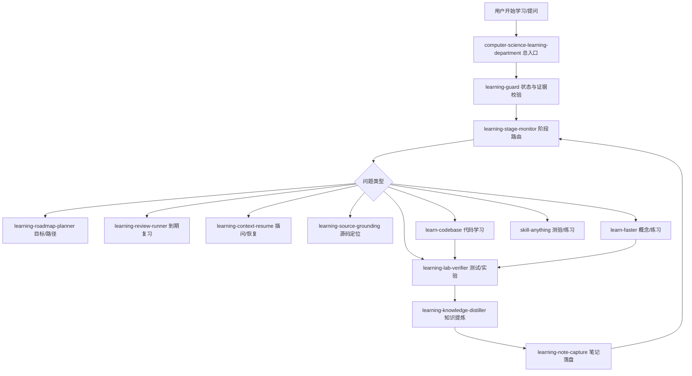

## 一、总入口和状态控制

### `computer-science-learning-department`

触发方式：

- 开始项目学习；
- 学习代码仓库；
- 制定学习阶段；
- 处理学习中断；
- 恢复学习；
- 进行里程碑、测验、复习或模块落盘。

路径：

- [CodeBuddy 版本](D:/Desktop/学习平台搭建/CodeBuddy学习区/.codebuddy/skills/computer-science-learning-department/SKILL.md)
- [OpenCode 版本](D:/Desktop/学习平台搭建/OpenCode学习区/.opencode/skills/computer-science-learning-department/SKILL.md)

职责：

- 作为学习总入口；
- 判断当前问题属于主线、插问、恢复还是目标替换；
- 路由到唯一的下一个 Skill；
- 要求项目代码问题先经过 `learning-source-grounding`。

### `learning-guard`

触发方式：

- 每轮实质性学习回答前；
- 每轮回答后；
- 修改学习阶段前；
- 验证、评估、复习、掌握或恢复学习时；
- 某个 Skill 提交阶段变更建议时。

路径：

- [CodeBuddy 版本](D:/Desktop/学习平台搭建/CodeBuddy学习区/.codebuddy/skills/learning-guard/SKILL.md)
- [OpenCode 版本](D:/Desktop/学习平台搭建/OpenCode学习区/.opencode/skills/learning-guard/SKILL.md)

职责：

- 校验学习状态；
- 校验证据；
- 校验 checkpoint；
- 阻止非法跳阶段；
- 不负责决定阶段。

### `learning-stage-monitor`

触发方式：

- 每轮学习开始时；
- 每轮学习结束时；
- 里程碑完成时；
- 需要阶段转换时；
- 用户说“本模块结束”“整理并落盘”时。

路径：

- [CodeBuddy 版本](D:/Desktop/学习平台搭建/CodeBuddy学习区/.codebuddy/skills/learning-stage-monitor/SKILL.md)
- [OpenCode 版本](D:/Desktop/学习平台搭建/OpenCode学习区/.opencode/skills/learning-stage-monitor/SKILL.md)

职责：

- 唯一拥有阶段、掌握状态、下一 Skill、下一动作的修改权；
- 判断是否可以进入验证、复习、提炼或笔记落盘；
- 不负责写笔记。

## 二、目标和路径规划

### `learning-roadmap-planner`

触发方式：

- “帮我制定学习路线”；
- “这个项目怎么学”；
- “我应该先学什么”；
- 目标模糊；
- 有截止日期；
- 需要拆分模块；
- 需要确定范围和前置知识；
- 需要制定项目复刻计划。

路径：

- [CodeBuddy 版本](D:/Desktop/学习平台搭建/CodeBuddy学习区/.codebuddy/skills/learning-roadmap-planner/SKILL.md)
- [OpenCode 版本](D:/Desktop/学习平台搭建/OpenCode学习区/.opencode/skills/learning-roadmap-planner/SKILL.md)

输出：

- 学习目标；
- 前置依赖；
- 模块顺序；
- 里程碑；
- 验收标准；
- 明确不包含的范围。

## 三、源码证据链

### `learning-source-grounding`

触发方式：

只要项目学习中出现以下内容就触发：

- 文件名；
- 函数名；
- 类名；
- 方法名；
- 配置项；
- 命令；
- 调用链；
- 报错；
- “这段代码做什么”；
- “这个函数返回什么”；
- “这个文件负责什么”。

例如：

```
_decide_strategy 返回什么策略？
```

不能直接回答，必须先定位源码。

路径：

- [共享 Codex 版本](D:/Desktop/学习平台搭建/.agents/skills/learning-source-grounding/SKILL.md)
- [CodeBuddy 版本](D:/Desktop/学习平台搭建/CodeBuddy学习区/.codebuddy/skills/learning-source-grounding/SKILL.md)
- [OpenCode 版本](D:/Desktop/学习平台搭建/OpenCode学习区/.opencode/skills/learning-source-grounding/SKILL.md)

脚本：

- [源码定位脚本](D:/Desktop/学习平台搭建/.agents/skills/learning-source-grounding/scripts/resolve-source-target.py)
- [源码引用校验脚本](D:/Desktop/学习平台搭建/.agents/skills/learning-source-grounding/scripts/validate-source-reference.py)

职责：

```
文件名/函数名
→ 搜索真实项目
→ 定位行号
→ 读取源码
→ 返回 code_blocks
→ 允许继续解释
```

如果出现以下情况，必须暂停：

- 多处同名定义；
- 文件不存在；
- 函数不存在；
- 文件太大但没有明确符号；
- 路径越界；
- 无法读取源码。

### `learn-codebase`

触发方式：

- 学习陌生代码仓库；
- 解释项目架构；
- 追踪调用链；
- 分析函数、类或模块；
- 解释设计取舍；
- 调试代码；
- 学习实现过程；
- 进行代码复盘或 teach-back。

路径：

- [CodeBuddy 版本](D:/Desktop/学习平台搭建/CodeBuddy学习区/.codebuddy/skills/learn-codebase/SKILL.md)
- [OpenCode 版本](D:/Desktop/学习平台搭建/OpenCode学习区/.opencode/skills/learn-codebase/SKILL.md)

前置条件：

```
项目代码问题
→ learning-source-grounding
→ 源码定位成功
→ learn-codebase 解释
```

### `learn-faster`

触发方式：

- 学习基础概念；
- 诊断知识盲点；
- 学习技术原理；
- 制定练习；
- 分析错误；
- 做迁移练习；
- 进行间隔复习。

路径：

- [CodeBuddy 版本](D:/Desktop/学习平台搭建/CodeBuddy学习区/.codebuddy/skills/learn-faster/SKILL.md)
- [OpenCode 版本](D:/Desktop/学习平台搭建/OpenCode学习区/.opencode/skills/learn-faster/SKILL.md)

如果问题涉及当前项目中的具体代码，也必须先经过 `learning-source-grounding`。

## 四、客观证据和验证

### `learning-lab-verifier`

触发方式：

- 需要运行测试；
- 需要执行命令；
- 需要做实验；
- 需要验证运行结果；
- 需要复现错误；
- 需要收集客观证据；
- 需要检查性能或行为。

路径：

- [CodeBuddy 版本](D:/Desktop/学习平台搭建/CodeBuddy学习区/.codebuddy/skills/learning-lab-verifier/SKILL.md)
- [OpenCode 版本](D:/Desktop/学习平台搭建/OpenCode学习区/.opencode/skills/learning-lab-verifier/SKILL.md)

记录：

- 环境；
- 命令；
- 退出码；
- 预期结果；
- 实际输出；
- evidence ID。

### `skill-anything`

触发方式：

- “考考我”；
- “给我出题”；
- “生成闪卡”；
- “做个测验”；
- “测试我是否理解”；
- “生成练习题”；
- “进行迁移训练”；
- “重新测试我”。

路径：

- [CodeBuddy 版本](D:/Desktop/学习平台搭建/CodeBuddy学习区/.codebuddy/skills/skill-anything/SKILL.md)
- [OpenCode 版本](D:/Desktop/学习平台搭建/OpenCode学习区/.opencode/skills/skill-anything/SKILL.md)

通常发生在：

```
学习/实现里程碑完成
→ skill-anything
→ 作答
→ 评分
→ 补救
→ 重测
```

## 五、插问和恢复

### `learning-context-resume`

触发方式：

- 临时插问；
- “先问个问题”；
- “暂停一下”；
- “回到主线”；
- “继续刚才”；
- “插问结束”；
- “恢复主线”；
- `/resume-learning`；
- `pop-branch`。

路径：

- [CodeBuddy 版本](D:/Desktop/学习平台搭建/CodeBuddy学习区/.codebuddy/skills/learning-context-resume/SKILL.md)
- [OpenCode 版本](D:/Desktop/学习平台搭建/OpenCode学习区/.opencode/skills/learning-context-resume/SKILL.md)

流程：

```
进入插问
→ 保存完整主线快照
→ 处理插问
→ 保存插问结论
→ pop-branch
→ 展示完整恢复卡片
→ 回到唯一下一步
```

恢复卡片包括：

- 原始目标；
- 项目和模块；
- 插问前主题；
- 主线位置；
- 已完成进度；
- 已确认理解；
- 最后一轮问答；
- 插问结论；
- 插问对主线的影响；
- 源码引用；
- 笔记链接；
- 唯一下一步。

## 六、复习和知识提炼

### `learning-review-runner`

触发方式：

- 学习会话开始；
- 存在到期复习；
- 存在逾期复习；
- 用户要求复习；
- 用户说“帮我回顾一下”；
- 复习队列中存在待处理任务。

路径：

- [CodeBuddy 版本](D:/Desktop/学习平台搭建/CodeBuddy学习区/.codebuddy/skills/learning-review-runner/SKILL.md)
- [OpenCode 版本](D:/Desktop/学习平台搭建/OpenCode学习区/.opencode/skills/learning-review-runner/SKILL.md)

流程：

```
检查 review queue
→ 提取回忆
→ 评分
→ 记录结果
→ 成功则安排下一次
→ 失败则回退到最小缺口阶段
```

### `learning-knowledge-distiller`

触发方式：

- 验证里程碑完成；
- 测验完成；
- 复习完成；
- 用户要求整理知识；
- 用户要求提炼结论；
- 周期性学习总结；
- 模块落盘前。

路径：

- [CodeBuddy 版本](D:/Desktop/学习平台搭建/CodeBuddy学习区/.codebuddy/skills/learning-knowledge-distiller/SKILL.md)
- [OpenCode 版本](D:/Desktop/学习平台搭建/OpenCode学习区/.opencode/skills/learning-knowledge-distiller/SKILL.md)

职责：

- 提炼因果模型；
- 提炼关键源码；
- 记录常见错误；
- 关联验证证据；
- 形成可复用知识资产。

代码结论必须带：

- 源码路径；
- 起止行号；
- 验证证据。

没有源码证据的代码结论只能标记为“未验证”。

## 七、笔记落盘

### `learning-note-capture`

触发方式：

只有以下情况触发：

- “本模块结束”；
- “整理笔记”；
- “落盘”；
- “写入本地笔记”；
- “保存这次学习内容”；
- `learning-stage-monitor` 发出模块完成信号。

不会因为以下情况自动触发：

- 一次回答结束；
- 用户说“我懂了”；
- 一轮代码解释结束；
- 一个插问结束。

路径：

- [共享 Codex 版本](D:/Desktop/学习平台搭建/.agents/skills/learning-note-capture/SKILL.md)
- [CodeBuddy 版本](D:/Desktop/学习平台搭建/CodeBuddy学习区/.codebuddy/skills/learning-note-capture/SKILL.md)
- [OpenCode 版本](D:/Desktop/学习平台搭建/OpenCode学习区/.opencode/skills/learning-note-capture/SKILL.md)

落盘流程：

```
当前对话
→ learning-source-grounding 定位源码
→ learning-knowledge-distiller 提炼结论
→ learning-context-resume 提供插问关系
→ learning-note-capture
→ 写入源码、图示、问答和总结
→ 更新 PROJECT-MAP.md
→ 校验
→ captured_and_valid
```

## 八、三端入口命令

### CodeBuddy

- [开始学习命令](D:/Desktop/学习平台搭建/CodeBuddy学习区/.codebuddy/commands/start-learning.md)
- [恢复学习命令](D:/Desktop/学习平台搭建/CodeBuddy学习区/.codebuddy/commands/resume-learning.md)
- [入口规则](D:/Desktop/学习平台搭建/CodeBuddy学习区/CODEBUDDY.md)

### OpenCode

- [开始学习命令](D:/Desktop/学习平台搭建/OpenCode学习区/.opencode/commands/start-learning.md)
- [恢复学习命令](D:/Desktop/学习平台搭建/OpenCode学习区/.opencode/commands/resume-learning.md)
- [入口规则](D:/Desktop/学习平台搭建/OpenCode学习区/AGENTS.md)

## 总结

整个系统可以压缩成：

```
computer-science-learning-department
        ↓
learning-guard
        ↓
learning-stage-monitor
        ↓
learning-source-grounding（代码问题）
        ↓
learn-codebase / learn-faster
        ↓
learning-lab-verifier
        ↓
skill-anything / learning-review-runner
        ↓
learning-knowledge-distiller
        ↓
learning-note-capture
        ↓
PROJECT-MAP.md + notes/*.md
```

最关键的三条规则是：

1. `learning-stage-monitor` 唯一控制阶段和掌握状态；
2. 代码问题必须先拿到真实源码证据；
3. 笔记只有返回 `captured_and_valid` 才算真正落盘成功。