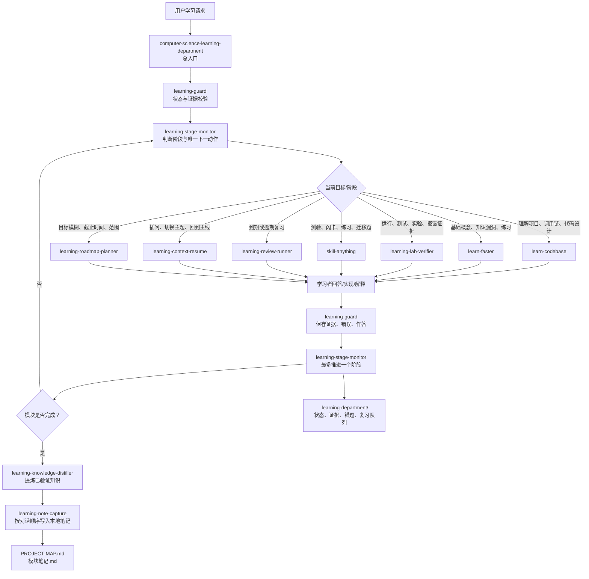

```mermaid
flowchart TD
    A["用户学习请求"] --> B["computer-science-learning-department<br/>总入口"]

    B --> C["learning-guard<br/>状态与证据校验"]
    C --> D["learning-stage-monitor<br/>判断阶段与唯一下一动作"]

    D --> E{"当前目标/阶段"}

    E -->|目标模糊、截止时间、范围| F["learning-roadmap-planner"]
    E -->|理解项目、调用链、代码设计| G["learn-codebase"]
    E -->|基础概念、知识漏洞、练习| H["learn-faster"]
    E -->|运行、测试、实验、报错证据| I["learning-lab-verifier"]
    E -->|测验、闪卡、练习、迁移题| J["skill-anything"]
    E -->|到期或逾期复习| K["learning-review-runner"]
    E -->|插问、切换主题、回到主线| L["learning-context-resume"]

    G --> M["学习者回答/实现/解释"]
    H --> M
    I --> M
    J --> M
    K --> M
    L --> M
    F --> M

    M --> N["learning-guard<br/>保存证据、错误、作答"]
    N --> O["learning-stage-monitor<br/>最多推进一个阶段"]

    O --> P{"模块是否完成？"}

    P -->|否| D
    P -->|是| Q["learning-knowledge-distiller<br/>提炼已验证知识"]
    Q --> R["learning-note-capture<br/>按对话顺序写入本地笔记"]
    R --> S["PROJECT-MAP.md<br/>模块笔记.md"]

    O --> T[".learning-department/<br/>状态、证据、错题、复习队列"]
```

