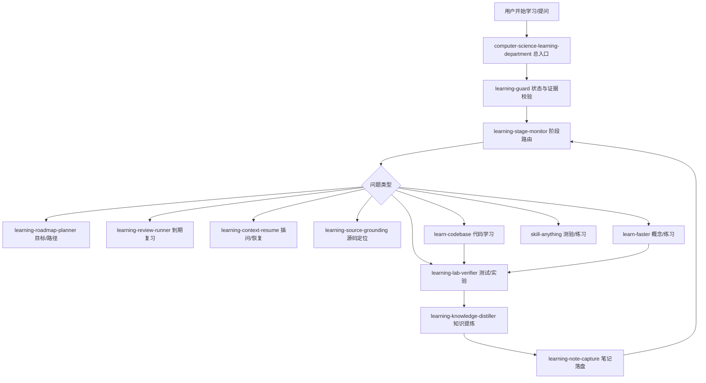
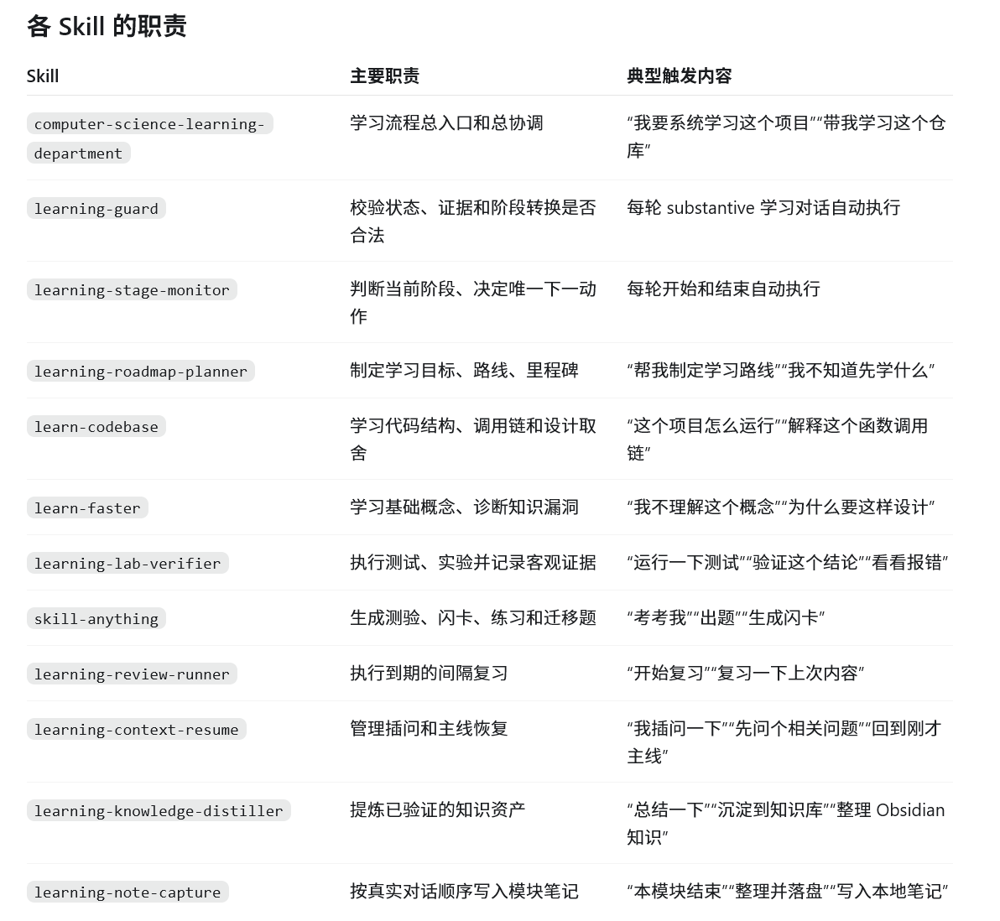

```mermaid
flowchart TD
    A["用户开始学习/提问"] --> B["computer-science-learning-department 总入口"]
    B --> C["learning-guard 状态与证据校验"]
    C --> D["learning-stage-monitor 阶段路由"]
    D --> E{"问题类型"}

    E --> F["learning-roadmap-planner 目标/路径"]
    E --> G["learning-review-runner 到期复习"]
    E --> H["learning-context-resume 插问/恢复"]
    E --> I["learning-source-grounding 源码定位"]
    E --> J["learn-codebase 代码学习"]
    E --> K["learn-faster 概念/练习"]
    E --> L["learning-lab-verifier 测试/实验"]
    E --> M["skill-anything 测验/练习"]

    J --> L
    K --> L
    L --> N["learning-knowledge-distiller 知识提炼"]
    N --> O["learning-note-capture 笔记落盘"]
    O --> D
```

