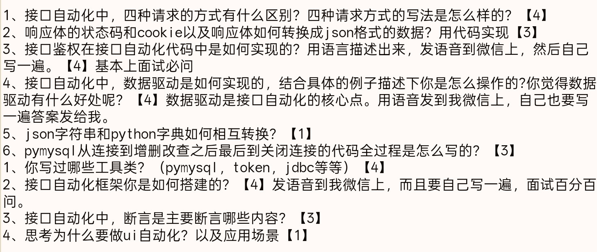

#### 1.接口自动化中 四种请求的方式有什么区别？四种请求方式的写法是怎么样的？
`get` 和 `delete` 是在请求行中发送数据的 所以他们用的是param
#### 2.响应体的状态码和cookie以及响应体如何转换成ison格式的数据?用代码实现
#### 3.接口鉴权在接口自动化代码中是如何实现的?用语言描述出来，发语音到微信上，然后自己写一遍
#### 4.接口自动化中，数据驱动是如何实现的，结合具体的例子描述下你是怎么操作的?你觉得数据驱动有什么好处呢?、
#### 5.json字符串和python字典如何相互转换?
#### 6.pymysql从连接到增删改查之后最后到关闭连接的代码全过程是怎么写的?
#### 7.你写过哪些工具类?(pymysql，token，jdbc等等)【4】

#### 8.接口自动化框架你是如何搭建的?
#### 9.接口自动化中，断言是主要断言哪些内容?
#### 10.思考为什么要做ui自动化?以及应用场景
