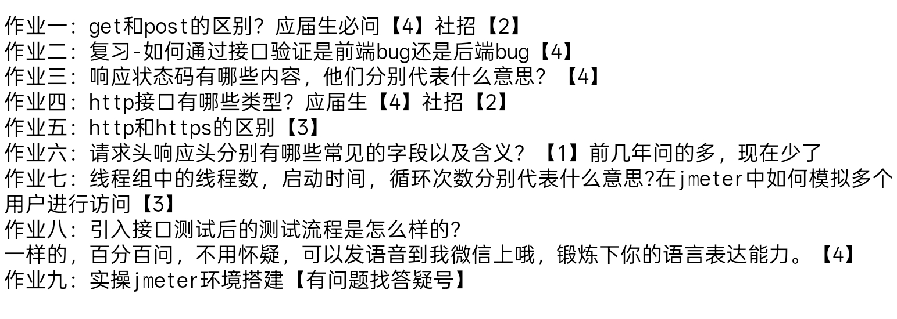

### 作业一
- get是客户端向服务端获取数据的方法
- post是服务端向客户端发送数据的方法
### 作业二
- 接口测试是绕过前端直接验证后端接口的一个测试方法 
- 所以当验证后端接口没问题的时候 （即响应符合文档规范) 那问题大概率在前端 
- 如果后端接口有问题 则目前仅能确定后端存在BUG 不能确保前端没有BUG 
### 作业三
- 2XX : 响应成功 不代表业务成功 
- 3XX : 重定向
- 4XX : 客户端错误
- 5XX : 服务端错误
### 作业四
get post delete put 
### 作业五
- 安全性：HTTP是明文传输 HTTPS是加密传输
- 端口：HTTP端口号默认是80 HTTPS端口号默认是443
- 速度：HTTPS因为加密的缘故 速度稍慢于HTTP
- 证书：HTTPS需要证书认证 HTTP不用
### 作业六
- 请求头里面常见字段有 请求方法 请求URL 状态代码等
- 响应头里面常见字段有 cookie date等
### 作业七
- 线程数：相当于线程组内的用户个数
- 启动时间：线程组内线程数完成线程任务的所需的时间
- 循环次数：线程组内每个线程执行的次数
要在Jmeter中模拟多个用户的请求 主要是修改线程组内的线程数 线程数是多少 用户就是多少 同时还应该注意循环次数 循环次数模拟的是一个用户的反复操作的次数

参考答案
https://www.kdocs.cn/l/csuES5Sb8mFR