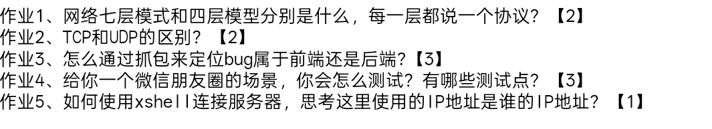

### 作业1
#### **OSI七层模型**：
包括**应用层**（HTTP）、**表示层**（SSL/TLS）、**会话层**（RPC）、**传输层**（TCP）、**网络层**（IP）、**数据链路层**（ARP）、**物理层**（WIFI/以太网）。
####  **TCP/IP四层模型**：
应用层:代表协议有 HTTP FTP DNS等
传输层:代表协议有TCP UDP等
网络层:代表协议有IP
网络接口层:代表协议有WIFI 蓝牙等
### 作业2
TCP是面向连接的(需要通过3次握手确认连接) UDP无连接
TCP可靠 他保证数据的安全送达以及顺序 UDP不可靠 他不要求数据是否按顺序抵达
TCP的传输速度比UDP慢且资源消耗UDP高
TCP的应用场景是在对数据顺序有严格要求的 例如网页登录
UDP的应用场景则是对实时性有严格要求的 例如音视频通话 实时性的交互游戏等等
### 作业3
可以在浏览器中通过抓包(F12)的相应和请求来定位是前端还是后端的BUG
前端问题： 如果本来请求方式就有问题 例如请求错误 URL不对 参数缺失或格式错误 则是前端问题
后端问题：如果前端发送的请求正确 但服务器的返回的状态吗有问题 例如5XX 则是后端BUG
### 作业4
#### 1.UI测试:
查看界面是否美观以及是否有界面的显示问题
#### 2.功能测试:
**发布功能**:纯文字 图文 短视频是否能够正常使用
**交互功能**:发布朋友圈 好友的点赞 评论 取消点赞 删除评论 删除朋友圈 能否实时更新显示 
**权限功能**:私密后的朋友圈好友是否还能再看到 非好友能否看到仅好友可见的功能
#### 3.兼容性测试
windows mac 安卓 iOS等 不同系统的微信朋友圈 不同版本号的微信朋友圈下的功能是否正常
弱网环境下刷新朋友圈的时候是否有友好提示
#### 4.易用性测试
操作步骤的行为路径是否符合日常习惯等
#### 5.性能测试
图片和视频的显示速度是否符合"3-5-8"原则以及朋友圈刷新显示的速度是否符合"3-5-8"原则
#### 6.安全测试
非好友状态下是否能看到仅好友可见的朋友圈
图文视频发布的内容是否安全健康符合法律规定等
### 作业5
- **连接方法**：在Xshell中新建会话，输入**服务器的IP地址**和端口号（通常SSH默认为22），然后输入用户名和密码进行连接。
- **IP地址归属**：这里使用的IP地址是**远程服务器（或虚拟机）的IP地址**。它是为了在网络中唯一定位到你要访问的那台计算机资源