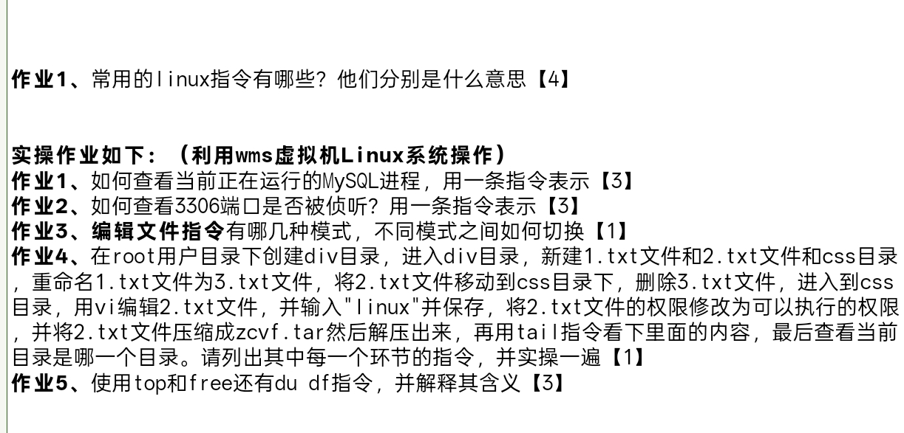

### 作业1
mkdir 创建目录
cd /目标目录 进入目标目录
touch 创建文件
rm 删除文件或目录
mv 移动文件 或者 重命名
ls 查看当前目录下有什么文件或目录
pwd 查看当前所在的绝对路径
top 动态的查看系统的进程运行情况 关键的东西有 pid 进程是所属于哪个用户的 运行时间 等等
| grep  过滤文件等等
vim 编写文件内容
free -h 服务器的内存信息
df -h 磁盘的剩余空间
du -h 目录下的文件大小
history 命令的历史记录
clear 清屏
cat 查看文件的内容
less 查看文件的内容 且支持grep 后 查询关键字 高亮显示 并且结束不会自动退出文件 速度比more快
more 查看文件的内容 比less慢 不支持高亮 会自动退出文件
whoami 查看当前的用户是谁
tail  -x(数字)f   查看文件末尾的x行
head -x(数字)f 查看文件的头部的x行

### 实操
#### 作业1
ps -ef | grep Mysql 
#### 作业2
netstat -plunt 3306
#### 作业3 
vim vi 
#### 作业4

mkdir div 
cd div
touch 1.txt 2.txt
mv 1.txt 3.txt
mkdir css
vi 2.txt ; i ;linux;wq!
mv 2.txt /css 
 rm -rf 1.txt
 cd css
 vi 2.txt ;i;linux;:wq!
 chmod 777 2.txt
tar -zcvf 2.txt  
tar -zxvf 2.tar.gz
####作业5
top的含义是动态的显示系统中的所有进程 里面关键的参数是 进程的所属用户 运行时间 进程的等等 free -h是显示服务器的内存信息
du -h是显示目录下文件大小
df -h是显示磁盘的剩余空间