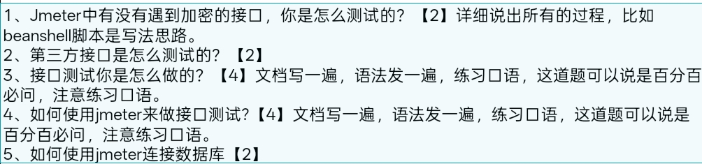

### 作业1
有的 加密的接口 我一般是这样测试的 如果加密的方法是MD5 我会用jmeter中的内置函数进行解密
如果是类似于sha256加盐等复杂的加密 会让开发在提供加密代码 直接在beanshell内调用即可
### 作业2
第三方接口的测试一般只需要做好字段验证 业务逻辑的验证 看接口是否返回成功 还有返回的状态码是否符合接口文档即可
如果是要排除bug的时候 要分清是代码中调用第三方接口调用失败了 还是第三方接口的bug
如果是自己调用失败的 可以让开发优化调用的代码等
如果是第三方接口的bug 可以反馈 但时间一般较长 或者考虑更换第三方接口
### 作业3
接口测试的流程是这样的
	1. 先确认需求和分工
	2. 使用接口文档进行分析接口的业务 其中包括URL 出参 入参 文本类型 响应的数据等等
	3. 设计接口的测试用例 组织用例评审
		如果是功能测试时候的接口测试 要求100%覆盖率 每个接口都必须包含正向+逆向的测试用例
		如果是旧功能回归测试进行的接口测试 则只需要对核心的高频的接口进行一次回归测试即可 只需要正向的测试用例
	4. 用jmeter编写接口测试的脚本 最后还得保证脚本的可复用性
	5. 最后产出测试报告 可以用jmeter中的图形化的测试报告
### 作业4 

jmeter的接口测试流程是这样的
	1. 拿到API文档后 了解接口的业务 包括 URL 出参 入参 请求方式 响应数据 文本类型 token鉴权 返回格式等等
	2. 设计测试用例
		1.在测试计划下新建一个线程组
		 2.在线程组下新建一个HTTP的请求的取样器 然后填入取样器中响应的数据 在