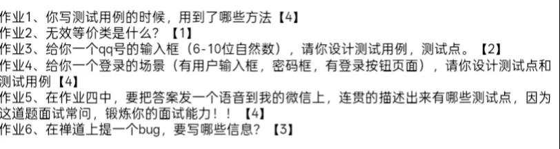

#### 作业1

等价类 边界值 判定表 场景法

#### 作业2

就是在一个场景中不满足需求 不满足功能要求的具体条件的等价类就是无效等价类

#### 作业3

QQ号码的测试用例 (6-10位的自然数)

一、测试点

1. 长度 是否支持 6 位 是否支持 10 位 少于 6 位是否提示错误 大于 10 位是否提示错误
2. 内容类型 是否只允许输入数字 输入字母是否报错 输入汉字是否报错 输入特殊符号是否报错 输入空格是否报错
3. 空值 不输入是否允许提交 只输入空格是否允许提交

二、测试用例

|编号|测试数据|预期结果|
|---|---|---|
|1|123456|通过|
|2|1234567890|通过|

|3|12345|不通过|
|---|---|---|
|4|12345678901|不通过|
|5|123456a|不通过|

|6|123456*|不通过|
|---|---|---|
|7|%123456|不通过|
|8|王者荣耀11|不通过|

|9|" ”|不通过|
|---|---|---|

#### 作业6

Bug ID： 唯一标识。

所属模块： 明确缺陷发生的功能模块。

标题： 简洁明了地描述问题。严重程度： 如严重（Crash/主功能不可用）、一般、微小。

优先级： 决定修复的先后顺序（高、中、低）。

复现步骤： 详细记录如何操作能触发该Bug。

预期结果： 根据需求文档应有的表现。

实际结果： 软件当前的实际错误表现。

缺陷类型： 代码错误、UI错误、兼容性等。附件： 如错误截图或日志文件。