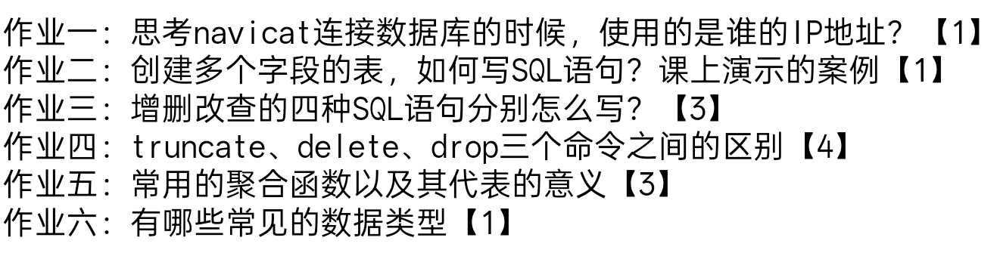

### 作业一
Navicat 连接数据库时，使用的是 MySQL 数据库所在服务器的 IP 地址
### 作业二
```MySQL
CREATE TABLE student (
    id INT PRIMARY KEY AUTO_INCREMENT,
    name VARCHAR(20),
    age INT,
    gender VARCHAR(10),
    phone VARCHAR(20),
    create_time DATETIME
);
```
### 作业三
- insert  增
- delete 删
- update 改
- select 查
### 作业四
- truncate的作用是删除数据的时候不会把表结构给删除 并且会把主键的自增的顺序给重置 并且只能删除整张表 不能加条件
- delete的作用是删除数据的时候 不会删除表结构 把数据删除时 主键的自增顺序不会改变 可以加where限制条件
- drop的作用怕删除整个表的数据 会破坏表结构
### 作业五
1. count() 总计
2. avg()  平均值
3. sum() 总和
4. max() 最大值
5. min() 最小值
### 作业六
#### 整数类型
- int
- tinyint
- bigint
#### 小数类型
- float
- double
- decimal
#### 字符型
- char
- varchar
- string
#### 时间类型
- date
- time


## 图谱关联

- 主题入口：[[03_MySQLMOC]]
- 对应笔记：[[数据库]]
- 对应面试题：[[3.Mysql基础_面试题]]
- 关联接口联动：[[第六天作业_MySQL_接口]]
- 总览入口：[[00_测试开发总览MOC]]

