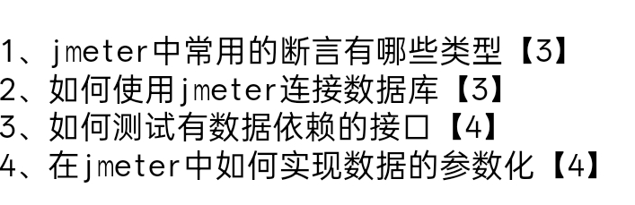

### 作业1.
1. JSON断言
2. 响应断言
3. 大小断言
### 作业2
在测试计划下新增一个JDBC Connect的配置元件 然后在里面的DataBase URL填写响应的数据库的链接 然后输入数据库的username跟password 然后在测试计划下添加一个连接数据库的jar包
### 作业3
在测试有数据依赖的接口的时候 应该分为几个线程组或者几个HTTP的请求 然后分为上下游接口 上游接口完成后出现的数据（例如token）可以用json提取器保存起来 给下游接口使用 如果是全局依赖 可以用beanshell后置处理器 在jmeter中的内置函数_setProperty() 输入相应的变量名 然后在信息头管理器使用jmeter中的内置函数  _property() 生成一个全局的属性   方便全局使用 如果要用
### 作业4
在jmeter中 有一个配置元件叫做CSV数据文件设置 可以先把csv文件先给写好 然后导入这个csv数据文件的配置 一般csv数据文件的第一行 都是做字段的说明 第二行开始 一行代表一条数据 一列代表一个字段 每个字段用逗号分开