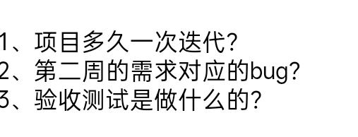

#### 1.项目多久一次迭代？
这个项目是采用**周迭代**（每周一个版本）的方式进行开发和测试的
#### 2.第二周的需求对应的BUG？
- **接口唯一性 Bug**：创建入库单的接口（`add-or-update`）没做**数据唯一性校验**，导致同样的入库单数据可以被多次添加。
- **业务逻辑 Bug**：入库单号的**生成规则错误**，没按照规定格式生成；或者是添加新物料时，会**重置**已经填好的旧物料数据。
- **显示类 Bug（重点案例）**：入库单列表里，**“作废”状态显示有误**（显示为空白）。通过抓包发现是前端在修改状态为作废时，压根没传状态值给后端
#### 3.验收测试是做什么的？
验收测试（Acceptance Testing）是项目上线前的最后一道关口，简单来说就是**让“给钱的人”或“定需求的人”确认东西做对没**。
- **谁来做**：通常由**测试人员提供验收用例**，由**产品经理**或者**客户**亲自动手操作完成验收。
- **怎么做**：不需要像系统测试那样点得那么细，而是挑选 **20%~30% 的核心正向用例**。重点关注**实际业务流程**是否通顺，站在用户的视角看软件好不好用。
- **结果**：验收通过并编写测试报告后，项目就可以准备上线了

## 图谱关联

- [[00_全库总览MOC]]
- [[00_测试开发总览MOC]]
- [[wms项目]]
- [[8.WMS项目_面试题]]
- [[04_接口测试MOC]]
- [[03_MySQLMOC]]
