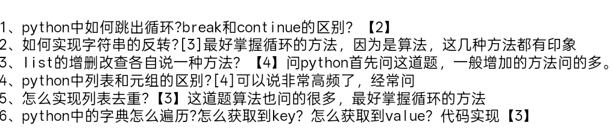

#### 1.python中如何跳出循环 break跟continue的区别？
python跳出循环 是在循环体中使用break 或者 continue关键字
break的作用是直接跳出循环体 接着执行循环体外部的程序
continue的作用是跳出本次循环 没有跳出整个循环体 下次循环执行的时候他仍然可继续执行
#### 2.如何实现字符串的反转？
实现字符串的反转有以下几种方式 
1. 使用切片 `[::-1]` 这种方式是最快最直接的 使用python中的字符串列表中的API进行修改
2. 使用forxun'h