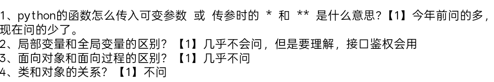

#### 1.python的函数怎么传入可变参数 或 传参时的 `*`和 `**`是什么意思?
`*` 和 `**` 用于处理函数的可变参数，主要分为“定义函数”和“调用函数”两种场景：
##### 1.在函数定义时 用于接收不定数量的参数
`*` （单星号）会将多个位置参数打包成元组
例如：
```
def func(*agrs):print(args)
调用func(1,2,3) 输出(1,2,3)
```
** （双星号）接受多余的关键字参数
会将形如`key = value`的参数打包成一个字典
例如：
```
def func(**kwargs): print(kwargs)
调用func(a=1,b=2) 输出{'a' = 1,'b'=2}
```
##### 2.在函数调用时 用于解包数据结构的操作
`*`  解包列表或者元组
它会将列表或者元组中的每个元素按顺序传给函数的位置参数
`**` 解包字典
它会将字典的键值对按名称传给对应的关键字参数。

#### 2.局部变量和全局变量的区别
1.定义域

1.作用域
全局变量的作用域是整个*.py文件内都可以使用
