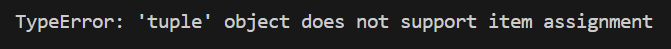

#### PDF


#### 字符串API
##### 字符串.replace("要被替换的内容", "替换成什么", 替换次数)

```Python
s = "听君一席话,如听一席话"
print(s.replace("一", "二"))  #听君二席话,如听二席话
print(s.replace("一", "二", 1))  #听君二席话,如听一席话
```

##### 字符串.count("要统计的内容", 开始下标, 结束下标)
```Python
s = "听君一席话,如听一席话"
print(s.count("一席话")) #2
print(s.count("一席话", 6, 11)) #1
```

##### 字符串.split("分隔符", maxsplit)
```python
s = "听君一席话,如听一席话"
print(s.split("一"))  # ['听君', '席话,如听', '席话']
print(s.split("一", 1)) # ['听君', '席话,如听一席话']
```
将一作为分隔符
maxsplit 最多分几次
##### startswith()：判断开头 endswith()：判断结尾
```Python
s = "听君一席话,如听一席话"​
print(s.startswith("听君")) #True​
print(s.endswith("话")) #True
```
##### **lower()：把英文字符变成小写**   **upper()：把英文字符变成大写**
```Python
s = "Hello World"​
print(s.lower()) #hello world  
print(s.upper()) #HELLO WORLD​
```
##### isalpha()判断是不是全是字母  isdigit()判断是不是全是数字  isalnum()判断是不是全是字母或数字
```Python
s1 = "helloworld"​
s2 = "123"​
s3 = "HelloWorld123"​
print(s1.isalpha()) #True​
print(s1.isdigit()) #False​
print(s1.isalnum()) #True
```

##### join()用某个“分隔符”，把一堆字符串拼接成一个新的字符串。
```Python
"分隔符".join(数据)  
```
`join()` 里面的数据必须都是**字符串**。
注意：  
`join()` 前面的那个字符串，是**用来连接数据的分隔符**。
```Python
s = "听君一席话,如听一席话"​
print("~".join(s)) # 听~君~一~席~话~,~如~听~一~席~话​
l = ["广东省", "广州市", "天河区..."]​
print("".join(l)) # 广东省广州市天河区...
print("-".join(l)) # 广东省-广州市-天河区...
```
#### 列表
列表 (List) 是 python 中使用非常频繁的数据类型, 在其他语言中通常叫做 数组
语法上用[]来定义一个列表, 数据之间用,分割, 例如:
```
name_list = ["张三", "李四", "王五"]
```
列表可以储存不同类型的数据
##### 列表的遍历
```python
name_list = ["张三", "李四", "王五"]​
# for实现列表遍历
for name in name_list:​
print(name)
# while实现列表遍历​
i = 0​
while i < len(name_list):​
print(name_list[i])​
i += 1
```
##### 列表增加元素的API
###### append 可以把数据加到列表的末尾
```Python
l = [1, 2]​
l.append(3)​
l.append("4")​
l.append(True)​
l.append([5, 6])​
print(l) #[1, 2, 3, '4', True, [5, 6]]
```
###### extend 可以把一个可迭代类型数据中的元素逐一添加到列表中 
```Python
a = [1, 2]​
b = [3, 4]​
c = "abc"​
a.extend(b)​
a.extend(c)​
print(a) # [1, 2, 3, 4, 'a', 'b', 'c']​
```
###### insert 可以在指定位置前插入数据
```PYTHON
l = [1, 2, 3, 4]​
l.insert(2, "a")​
print(l) # [1, 2, 'a', 3, 4]
```

##### 列表删除元素的API
###### pop 根据索引删除列表中的数据, 默认删除列表中的最后一个数据
```Python
l = [1, 2, 3, 4]​
#l.pop()​
#l.pop()​
l.pop(0)​
l.pop(2) # 注意把索引0的数据删除后的新列表的最后一位下标是2​
print(l) # [2, 3]
```
###### remove 根据值从列表中删除数据
```Python
l = [1, 2, 3, 4]​
l.remove(2)​
print(l) # [1, 3, 4]
```
##### 列表修改元素
常见是根据下标进行数据的修改
```python
l = [1, 2, 3, 4]​
l[1] = 3​
print(l)
```
##### 列表查询元素
in 和 not in 用于判断列表中是否存在某数据, 成功为True, 失败为False
```python
l = [1, 2, 3, 4]​
if 1 in l:​
print("存在")​
if 5 not in l:​
print("不存在")
```
index 和 count, 与字符串中的用法相同
```python
l = [1, 2, 3, 4]​
print(l.index(1))​
print(l.count(1))​
print(l.index(2))​
print(l.count(2))
```
###### 排序
###### sort方法是将列表按顺序重新排列, 默认为由小到大, 参数reverse=True可改为倒序​
```Python
l4 = [1, 3, 4, 2]
l4.sort()
print(l4) # [1, 2, 3, 4]
l4.sort(reverse=True)
print(l4) # [4, 3, 2, 1]
```
###### 注意: 需要排序的列表中的数据需要是同一类型的, 同时存在整数和字符串就不能排序​
```python
l5 = ["b", "c", "a"]
l5.sort()
print(l5) # ['a', 'b', 'c']
```
#### 元组
元组 (Tuple) 是与列表类似, 语法上用()来定义一个元组
```python
l = [1, 2, 3]​
t = (1, 2, 3)​
print(type(l))​
print(type(t))
```
###### 元组中的数据不能修改
```python
l = [1, 2, 3]​
t = (1, 2, 3)​
print(l[1])​
print(t[1])​
l[1] = 4​
t[1] = 4 # TypeError: 'tuple' object does not support item assignment
```

###### 对元组内的数据的操作只支持查询类操作, 如: index, count
```python
t = (1, 2, 3, 4, 4, 5)​
print(t.index(3))​
print(t.count(4))
```

#### 面试题 
##### python中列表和元组的区别?[2]​
列表是动态的, 列表中的数据支持各种增删改查的操作, 元组是静态的, 元祖中的数据只支持查询类操作, 可以理解为元组就是一个只读的列表​
从定义的角度来说, 列表的定义需要中括号, 元组是用小括号来定义的​
从设计的角度讲, 列表用于储存一系列动态变化的数据, 如: 坐标, 日期等, 元组用于储存不变的数据, 比如星期几​
从性能的角度说, 元组的性能优于列表 (这和内存分配机制有关)​
#####  如何通过切片获取一个数据中倒数的3个元素?[1]​
首先很多数据类型都支持切片的操作, 比如字符串, 列表, 元组等​
切片的语法是储存数据的变量名后面跟个中括号, 中括号内分别是起始位, 结束位 和 步长​
那么想获取倒数的三个元素只需要设置起始位为负3即可 (形式如: 变量名[-3:])