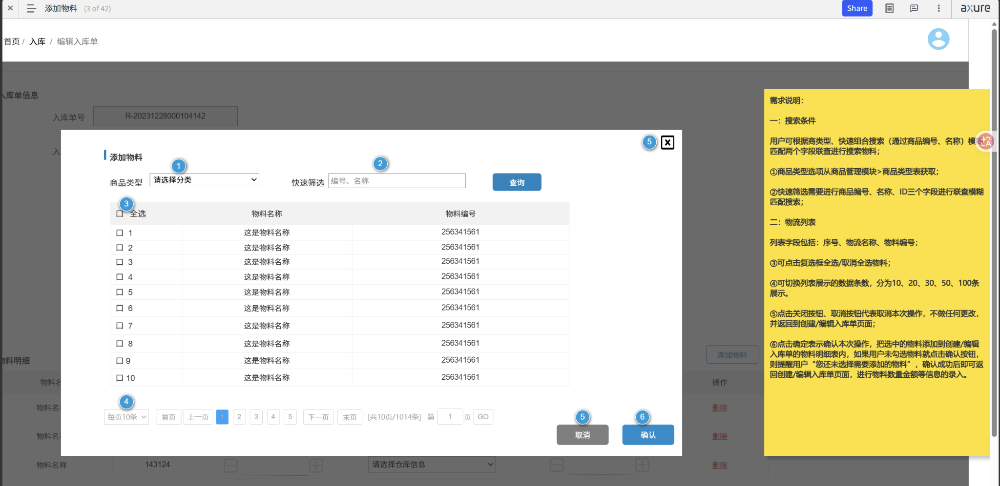

.pdf)

这个是jmeter中调试取样器中获得的数据库中role_id的数据 ==role_id_# = 1== 他的意思是这一轮中查询到新增的role_id的个数是1个  ==role_id_1 = 108== 这个的意思是查询符合这个数据库请求的role_id的个数的第一个是108

这个抓包的意思是 查询第一页中的前10条数据

进行的逻辑删除 不是物理删除
jmeter中的接口测试的图形化测试报告
在jmeter中的命令行输入 
***Jmeter -n -t  xxx.jmx -l  xxx.log -e - o xxx***

# 需求评审上可以提的问题
## 一、搜索条件相关

### 1. 商品类型是必选还是非必选？

可以问：

> 商品类型不选择时，是否允许直接查询？  
> 如果不允许，需要什么提示？  
> 如果允许，是查询全部物料，还是默认某个分类？

因为截图里商品类型默认是“请选择分类”，但不清楚是否必填。

---

### 2. 商品类型的数据来源是什么？

可以问：

> 商品类型下拉框的数据是从商品管理模块实时获取吗？  
> 如果商品类型被停用、删除，是否还展示？  
> 是否只展示当前用户有权限查看的商品类型？

这个涉及数据来源和权限。

---

### 3. 快速筛选支持哪些字段？

需求里写了：

> 商品编号、名称、ID 三个字段进行联合模糊匹配搜索

可以问：

> 快速筛选输入框到底支持按哪些字段搜索？  
> 是商品编号、商品名称、商品ID都支持吗？  
> 如果输入一个关键字，是三个字段 OR 查询，还是 AND 查询？

推荐确认成：

> 输入“123”，只要编号、名称、ID 任一字段包含 123 就展示。

---

### 4. 搜索是精确匹配还是模糊匹配？

可以问：

> 快速筛选是完全匹配，还是包含匹配？  
> 比如输入“物料”，是否可以查到“这是物料名称”？

---

### 5. 空格、特殊字符怎么处理？

可以问：

> 输入前后空格是否自动去除？  
> 输入特殊字符，比如 `%`、`_`、`@`、中文空格，系统怎么处理？  
> 是否需要限制最大输入长度？

这个是接口测试和异常输入测试的重点。

---

### 6. 商品类型 + 快速筛选之间是什么关系？

可以问：

> 商品类型和快速筛选是组合查询吗？  
> 是先按商品类型过滤，再在结果中按关键字筛选吗？

例如：

> 选择“电子类”，输入“电池”，是不是只查电子类下面名称/编号/ID包含电池的物料？

---

## 二、物料列表相关

### 7. 列表字段是否只有这几个？

截图里有：

> 序号、物料名称、物料编号

可以问：

> 物料列表是否只展示序号、物料名称、物料编号？  
> 是否需要展示规格、单位、库存数量、仓库、供应商等信息，方便用户判断是不是选对物料？

这个问题很有价值，因为只靠“物料名称”和“物料编号”有时不够区分。

---

### 8. 序号是当前页序号还是全局序号？

可以问：

> 列表中的序号是当前页从 1 开始，还是根据总数据连续编号？  
> 比如第 2 页第一条是 1，还是 11？

这个是测试分页时必须明确的。

---

### 9. 物料是否可能重复？

可以问：

> 是否允许同一个物料名称对应多个物料编号？  
> 如果名称相同，用户靠什么区分？  
> 是否需要展示规格型号？

---

## 三、勾选逻辑相关

### 10. 单选还是多选？

截图中有复选框和“全选”，说明应该是多选。

可以问：

> 添加物料是否支持一次选择多个？  
> 有没有最大选择数量限制？

---

### 11. 全选是选当前页，还是选全部查询结果？

这个非常关键。

可以问：

> 点击“全选”时，是只选中当前页 10 条，还是选中当前查询条件下的全部 1014 条？

一般更合理的是：

> 全选只作用于当前页。

否则如果全选 1014 条，用户可能误操作。

---

### 12. 跨页选择是否保留？

可以问：

> 用户在第 1 页勾选了 3 条，再切到第 2 页，之前选中的物料是否保留？  
> 如果再次回到第 1 页，勾选状态是否还在？

这个是很容易漏的需求点。

---

### 13. 搜索后已选中的物料是否保留？

可以问：

> 用户先勾选了一些物料，然后改变搜索条件重新查询，之前已选中的物料是否保留？  
> 如果保留，确认时是否一起提交？  
> 如果不保留，是否需要提示用户？

这是典型的需求歧义点。

---

### 14. 已经添加过的物料是否还能再选？

非常重要。

可以问：

> 如果入库单明细里已经存在某个物料，再次打开添加物料弹窗时，这个物料是否还展示？  
> 如果展示，是禁用勾选，还是允许再次添加？  
> 如果重复添加，系统是合并数量，还是提示不能重复添加？

这关系到后续入库单明细是否会出现重复行。

---

## 四、分页相关

### 15. 每页条数有哪些？

需求写了：

> 10、20、30、50、100 条

可以问：

> 每页条数切换后，当前页是否重置为第一页？  
> 已勾选的数据是否保留？

---

### 16. 总条数和总页数怎么算？

截图里有：

> 共10页/1014条

但是 1014 条如果每页 10 条，应该是 102 页，不是 10 页。

你可以直接问：

> 这里的“共10页/1014条”是否是原型展示错误？  
> 每页10条，1014条数据理论上应该是102页，最终以哪个规则为准？

这个问题很专业，评审时很容易体现你认真看了原型。

---

### 17. 页码输入跳转规则是什么？

可以问：

> 页码输入框支持手动输入跳转吗？  
> 输入 0、负数、字母、超过最大页数时怎么处理？  
> 点击 GO 后是否需要提示？

---

## 五、确认 / 取消 / 关闭相关

### 18. 没有选择物料时点击确认怎么办？

需求里说：

> 若未选择需要添加的物料，则提醒用户“您还未选择需要添加的物料”

可以问：

> 提示方式是弹窗、Toast，还是表单校验提示？  
> 提示后弹窗是否保持打开？

推荐结果：

> 保持弹窗打开，让用户继续选择。

---

### 19. 确认后添加到哪里？

可以问：

> 点击确认后，选中的物料添加到入库单明细区域的什么位置？  
> 是追加到最后，还是按物料编号排序？  
> 添加后是否自动关闭弹窗？

---

### 20. 确认后需要回填哪些字段？

可以问：

> 添加物料后，入库单明细需要回填哪些字段？  
> 物料名称、物料编号、规格、单位、默认仓库、默认数量、单价是否自动带出？  
> 哪些字段需要用户手动填写？

截图下面隐约有入库明细，这个一定要问清楚。

---

### 21. 点击取消和右上角关闭有什么区别？

需求里写取消按钮和关闭按钮都取消操作。

可以问：

> 点击“取消”和右上角 X 是否完全一致？  
> 如果用户已经勾选了物料，点击取消/关闭是否需要二次确认？  
> 还是直接关闭并清空选择？

如果不问清楚，测试时会有歧义。

---

### 22. 关闭后再次打开，搜索条件是否清空？

可以问：

> 弹窗关闭后再次打开，商品类型、快速筛选内容、页码、已勾选状态是否重置？  
> 还是保留上一次操作状态？

一般建议：

> 重新打开时重置为默认状态。

---

## 六、权限与数据范围

### 23. 不同用户能看到的物料是否一样？

可以问：

> 物料列表是否受用户权限、仓库权限、组织权限限制？  
> 用户只能看到自己有权限入库的物料吗？

这个问题偏测试开发/业务权限，非常有价值。

---

### 24. 停用物料是否展示？

可以问：

> 已停用、已删除、不可入库的物料是否展示？  
> 如果展示，是否允许选择？

建议明确：

> 只展示可用、可入库状态的物料。

---

## 七、异常场景

### 25. 查询无结果时怎么展示？

可以问：

> 查询无结果时，列表显示空白，还是显示“暂无数据”？  
> 分页区域是否隐藏？

---

### 26. 接口失败时怎么提示？

可以问：

> 查询物料接口失败、超时、网络异常时，页面如何提示？  
> 是否允许用户重新查询？

---

### 27. 数据加载中有没有 loading？

可以问：

> 点击查询后，是否需要 loading 状态？  
> 查询过程中按钮是否禁用，避免重复点击？

这个对用户体验和接口重复请求都重要。

---

## 八、性能相关

### 28. 物料很多时怎么处理？

可以问：

> 如果物料有几万条，搜索是否是后端分页查询？  
> 还是前端一次性加载全部数据再筛选？

正常应该是：

> 后端分页 + 后端条件查询。

---

### 29. 快速筛选是否需要防抖？

如果输入框是实时搜索，可以问：

> 快速筛选是点击“查询”才搜索，还是输入时自动搜索？  
> 如果是自动搜索，是否需要防抖，避免频繁请求接口？

截图里有查询按钮，所以大概率是点击查询才搜索。

---

## 九、可以在评审会上重点提的几个高价值问题

你如果不想问太多，可以优先问这 8 个：

1. **商品类型是否必选？不选时能不能查询全部？**
2. **快速筛选是按编号、名称、ID 三个字段 OR 模糊查询吗？**
3. **全选是选当前页，还是选全部查询结果？**
4. **跨页勾选是否保留？搜索后已选数据是否保留？**
5. **已添加过的物料再次打开弹窗时是否还能重复添加？**
6. **确认后回填到入库单明细的字段有哪些？哪些字段需要手动录入？**
7. **取消和右上角关闭是否都会清空本次选择？再次打开是否重置查询条件？**
8. **分页这里“每页10条但共10页/1014条”是否是原型错误？最终分页规则是什么？**

---

你可以这样在评审里说：

> 我这边主要有几个确认点：第一，快速筛选是商品编号、名称、ID 三个字段做 OR 模糊匹配吗？第二，全选是只选当前页还是当前查询结果下的全部数据？第三，跨页选择和搜索后已选数据是否保留？第四，已经添加到入库单明细里的物料，是否允许重复添加？第五，确认后需要回填哪些字段到明细表？这些点如果不明确，后续开发和测试用例都会有歧义。

# 图谱关联

- 主题入口：[[04_接口测试MOC]]、[[03_MySQLMOC]]
- 对应基础：[[jmeter新手操作学习要点整理]]
- 对应笔记：[[接口测试]]、[[数据库]]
- 对应作业：[[第六天作业_MySQL_接口]]、[[第七天作业_接口测试]]
- 对应面试题：[[4.接口测试_面试题]]、[[3.Mysql基础_面试题]]
- 总览入口：[[00_测试开发总览MOC]]
