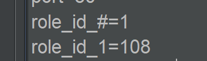
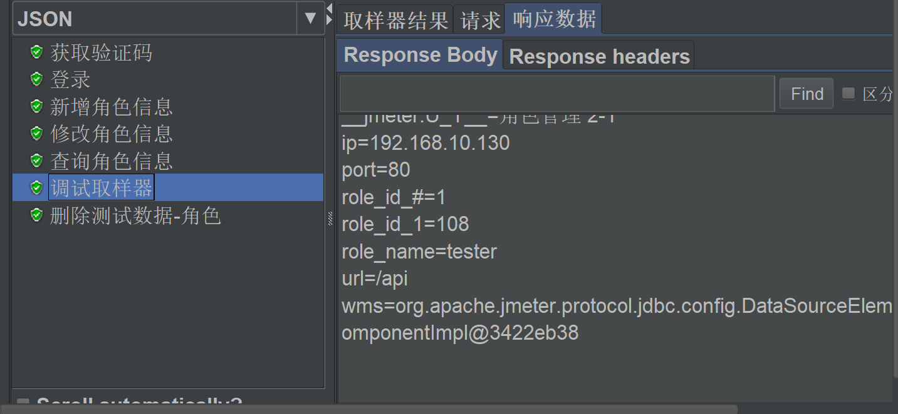
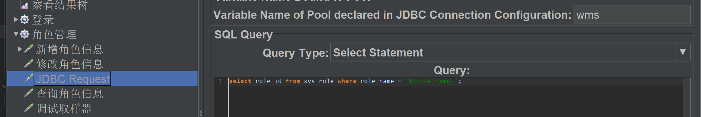
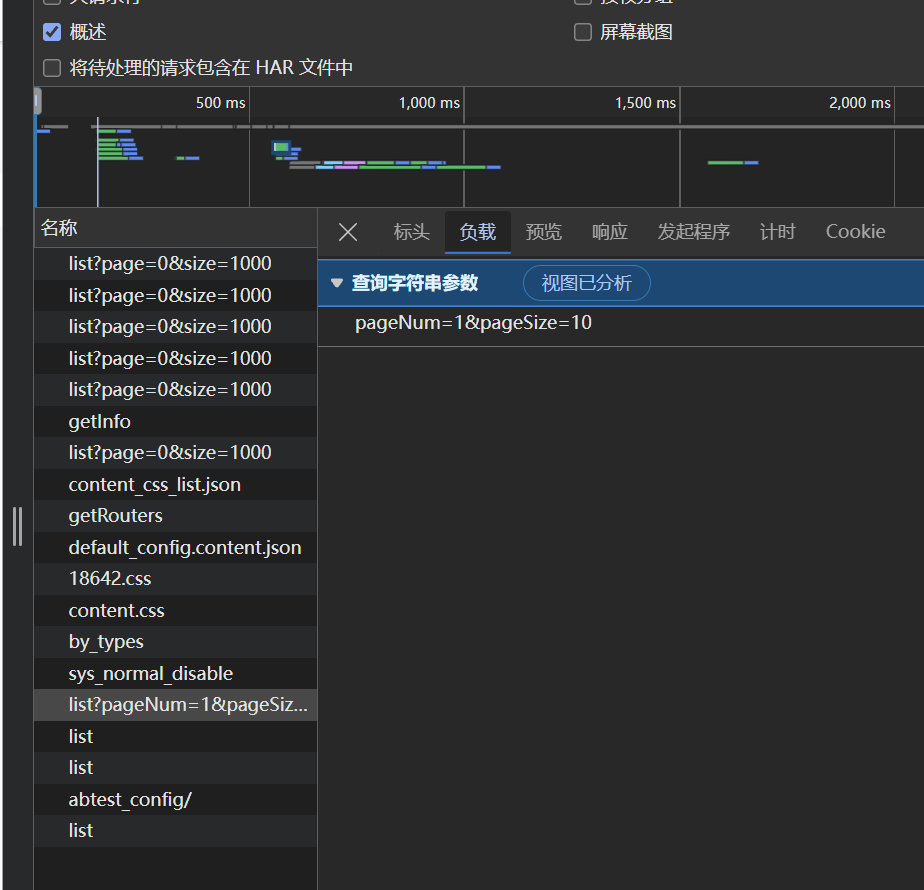
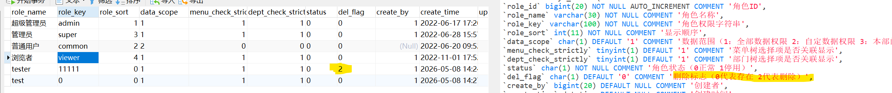
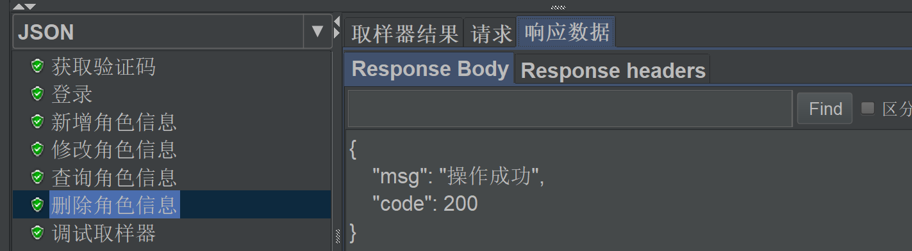
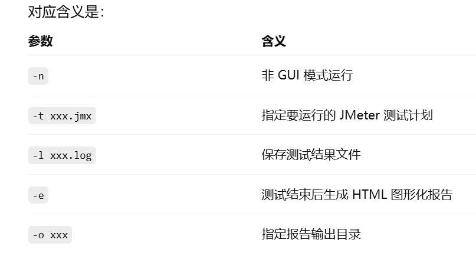

.pdf)

这个是jmeter中调试取样器中获得的数据库中role_id的数据 ==role_id_# = 1== 他的意思是这一轮中查询到新增的role_id的个数是1个  ==role_id_1 = 108== 这个的意思是查询符合这个数据库请求的role_id的个数的第一个是108

这个抓包的意思是 查询第一页中的前10条数据

进行的逻辑删除 不是物理删除
jmeter中的接口测试的图形化测试报告
在jmeter中的命令行输入 
***Jmeter -n -t  xxx.jmx -l  xxx.log -e - o xxx***

## 图谱关联

- 主题入口：[[04_接口测试MOC]]、[[03_MySQLMOC]]
- 对应基础：[[jmeter新手操作学习要点整理]]
- 对应笔记：[[接口测试]]、[[数据库]]
- 对应作业：[[第六天作业_MySQL_接口]]、[[第七天作业_接口测试]]
- 对应面试题：[[4.接口测试_面试题]]、[[3.Mysql基础_面试题]]
- 总览入口：[[00_测试开发总览MOC]]
