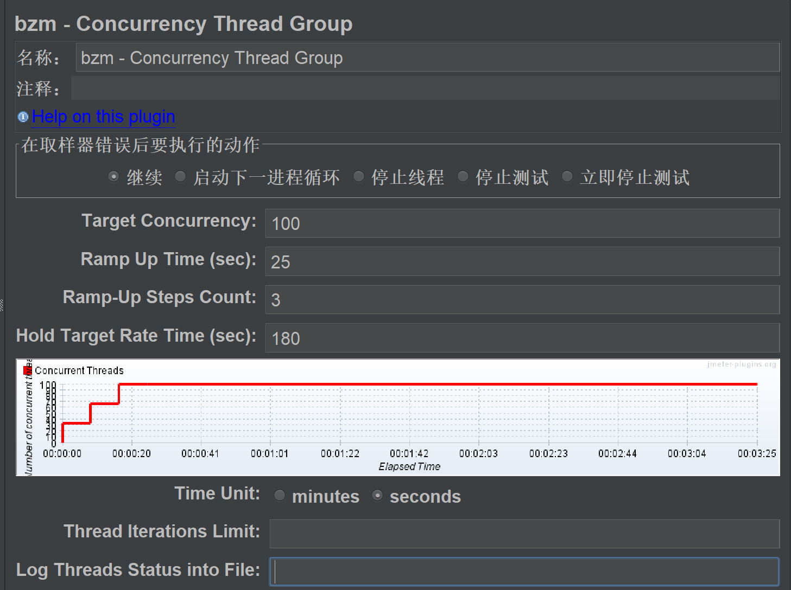
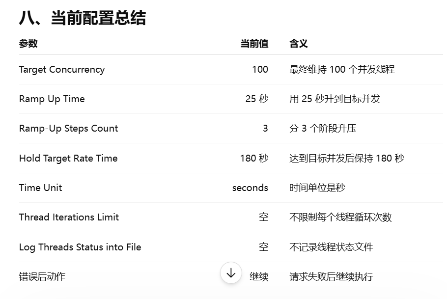

### Concurrency Thread Group

### 配置说明
Concurrency Thread Group 控制的是“并发用户数”。
Target Concurrency 决定最终并发多少人；
Ramp Up Time 决定多久升上去；
Ramp-Up Steps Count 决定分几步升上去；
Hold Target Rate Time 决定达到目标并发后保持多久。

