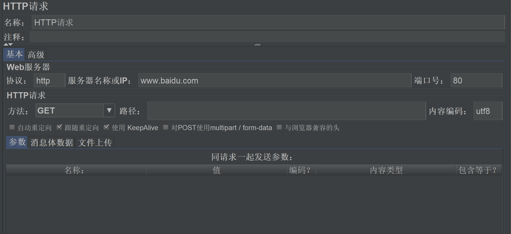
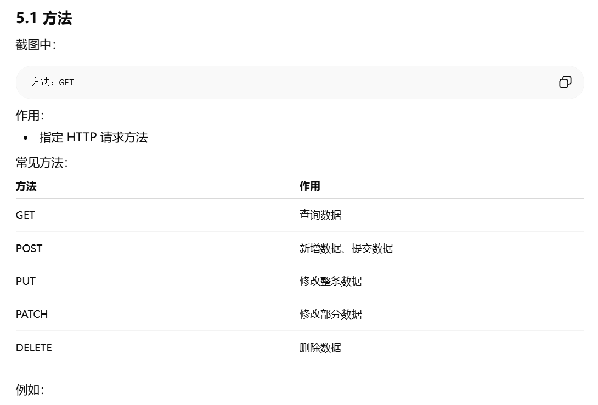
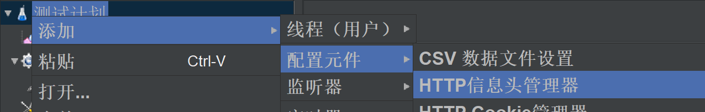
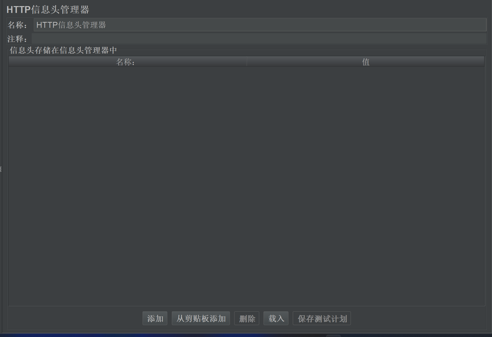
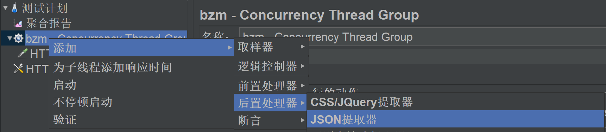
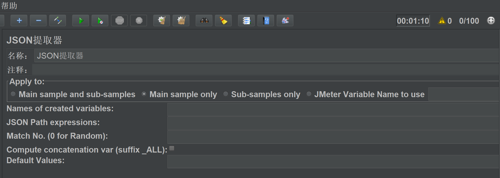
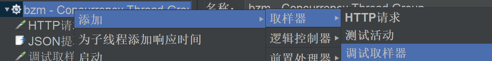
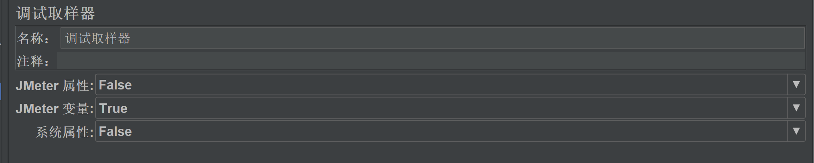
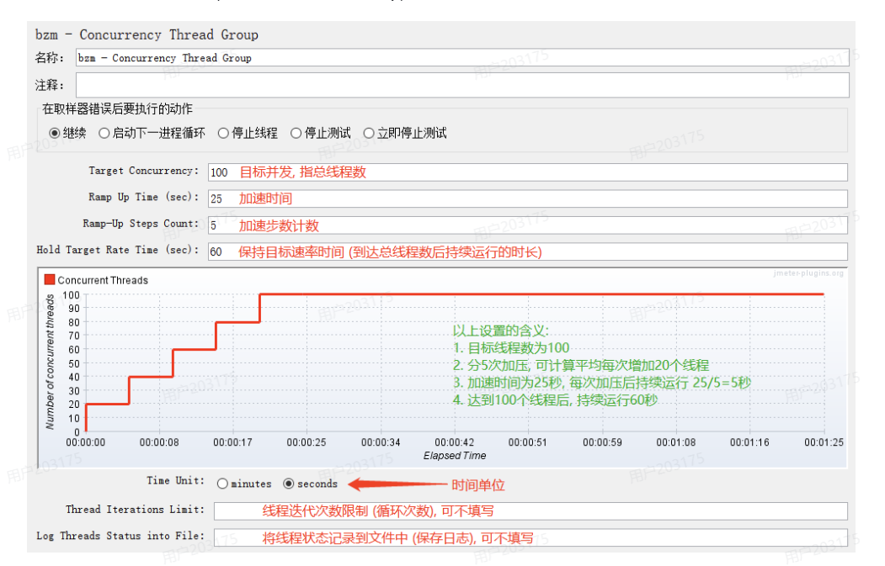
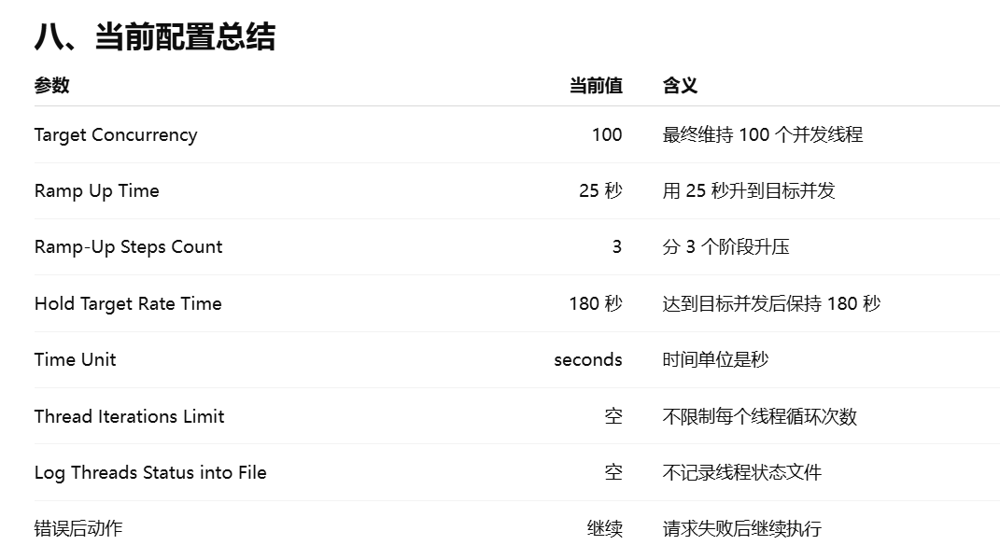

## 接口测试相关组件
### 1.HTTP Request

#### 作用
HTTP Request 是 JMeter 做接口测试最核心的取样器，用来真正发送 GET、POST、PUT、DELETE 等请求。

#### 操作方式
1. 在线程组上右键。
2. 选择：`添加 -> 取样器 -> HTTP请求`。
3. 给请求取一个能看懂的名字，例如：`登录接口`、`查询用户列表`、`创建入库单`。

#### 基本填写位置
- `方法`：选择接口文档要求的请求方式，如 GET、POST。
- `路径`：填写接口路径，例如 `/api/login`。
- `协议 / 服务器名称或IP / 端口号`：如果前面配了 `HTTP请求默认值`，这里可以不填；如果没配，就在这里单独填。
- `内容编码`：常见填 `UTF-8`。

#### 下面 3 个页签怎么用
- `参数`：放 query 参数，或者 `x-www-form-urlencoded` 表单参数。
- `消息体数据`：放 JSON 请求体。
- `文件上传`：放上传文件接口需要的文件路径、参数名、MIME 类型。

#### 最常见的两种填写方式
- GET 查询接口：
  - 方法选 `GET`
  - 参数放在 `参数` 页签
  - 一般不用 `消息体数据`
- POST JSON 接口：
  - 方法选 `POST`
  - JSON 内容放在 `消息体数据`
  - 请求头里通常还要配 `Content-Type: application/json`

#### 操作步骤示例
- 如果是登录接口：
  - 方法：`POST`
  - 路径：`/api/login`
  - 消息体数据：填写用户名和密码的 JSON
  - 再配一个 `HTTP Header Manager`，加上 `Content-Type: application/json`
- 如果是查询列表接口：
  - 方法：`GET`
  - 路径：`/api/user/list`
  - 参数页签填写 `pageNum`、`pageSize`

#### 常见错误
- GET 请求把参数写进了 `消息体数据`
- POST 的 JSON 写进了 `参数` 页签
- 路径里少了 `/`
- `Content-Type` 和请求体格式不一致
- 地址、端口、路径重复填写，导致拼接错误

#### 一句话理解
HTTP Request 就是“真正发请求的地方”，接口文档里的 URL、方法、参数、请求体，最后都要落到这里。

在一个线程组下创建一个HTTP请求

### 2.HTTP Header Manager

#### 作用
HTTP Header Manager 用来统一设置请求头，例如 `Content-Type`、`Accept`、`Authorization`。

#### 操作方式
1. 在线程组、测试计划，或者某个 HTTP 请求上右键。
2. 选择：`添加 -> 配置元件 -> HTTP信息头管理器`。
3. 在表格里填写请求头的 `名称` 和 `值`。

#### 常见写法
- `Content-Type`：`application/json`
- `Accept`：`application/json`
- `Authorization`：`${token}`
- 跨线程组取 token：`${__P(token,NOT_FOUND)}`

#### 一般放在哪
- 放在 `测试计划` 下：整个脚本都能共用。
- 放在 `线程组` 下：当前线程组里的请求共用。
- 放在 `某个HTTP请求` 下：只对这个请求生效。

#### 什么时候必须配
- 发 JSON 请求体时，一般要配 `Content-Type: application/json`
- 需要 token 鉴权时，要配 `Authorization`
- 接口文档要求特定请求头时，要按文档补齐

#### 常见错误
- JSON 请求体写了，但没有配 `Content-Type`
- token 需要 `Bearer`，结果没加；或者返回值已带 `Bearer`，又手动加了一次
- 把请求头挂错位置，导致以为生效了其实没生效

#### 一句话理解
HTTP Header Manager 就是“专门配请求头的地方”。

### 3.JSON Extractor

#### 作用
JSON Extractor 用来从上一个接口响应中提取字段，保存成变量，给后续接口继续使用。

#### 操作方式
1. 一般挂在“要提取响应数据”的那个 HTTP 请求下面。
2. 右键该请求，选择：`添加 -> 后置处理器 -> JSON提取器`。
3. 配置提取规则。

#### 核心配置项
- `Apply to`：一般选 `Main sample only`
- `Names of created variables`：变量名，例如 `token`
- `JSON Path expressions`：JSONPath，例如 `$.data.token`
- `Match No.`：一般填 `1`，表示取第一个
- `Default Values`：推荐填 `NOT_FOUND`

#### 最常见示例
- 如果登录响应里有 token：
  - 变量名填：`token`
  - JSONPath 填：`$.data.token`
- 后续同线程组接口直接用：`${token}`

#### 什么时候用
- 登录后提取 token
- 新增成功后提取 `id`
- 查询接口后提取某个业务字段给后面的接口继续用

#### 常见错误
- JSONPath 写错
- `Apply to` 选错，不是从主响应里提取
- 提取器没有挂在对应请求下面
- `Default Values` 没填，提取失败不容易发现

#### 一句话理解
JSON Extractor 就是“从响应里取值，存成变量给后面用”。

### 4.Debug Sampler

#### 作用
Debug Sampler 不是拿来发真实接口请求的，而是拿来查看当前脚本里的变量、属性、参数有没有拿到。

#### 操作方式
1. 在线程组下右键。
2. 选择：`添加 -> 取样器 -> Debug Sampler`。
3. 再配一个 `View Results Tree`，运行后查看调试结果。

#### 主要看什么
- JMeter Variables：看 `${token}`、`${userId}` 这种变量有没有值
- JMeter Properties：看 `${__P(token,NOT_FOUND)}` 这种全局属性有没有值
- Sampler Properties：看当前取样器的一些信息

#### 常见使用场景
- 查看 CSV 参数化有没有读到值
- 查看 JSON 提取器有没有提取成功
- 查看跨线程组保存的 property 有没有生效

#### 常见错误
- 误以为 Debug Sampler 会真的调用接口
- 没有配 `View Results Tree`，结果看不到输出
- 在性能压测时保留 Debug Sampler，影响脚本整洁度

#### 一句话理解
Debug Sampler 就是“专门用来看变量和属性的调试组件”。

### 5.View Results Tree

#### 作用
View Results Tree 用来查看每一个请求到底发了什么、回了什么，是接口脚本排错最常用的监听器。

#### 操作方式
1. 在线程组下右键。
2. 选择：`添加 -> 监听器 -> 察看结果树`。
3. 运行脚本后，点击左侧每个请求，在右侧看详细内容。

#### 重点看哪些页签
- `请求`：看实际发出去的 URL、方法、参数、消息体
- `响应数据`：看后端返回的内容
- `响应头`：看服务端返回头
- `请求头`：看自己带出去的请求头
- `断言结果`：看断言是否通过

#### 最适合干什么
- 排查参数有没有传对
- 排查 token 有没有带上
- 排查响应到底返回了什么
- 排查断言为什么失败

#### 注意
- 功能调试时很好用
- 真正做性能压测时，一般不建议一直开着，因为它比较占内存

#### 一句话理解
View Results Tree 就是“看请求和响应细节的地方”。

### 6.Response Assertion

#### 作用
Response Assertion 用来判断响应文本、响应码等内容是否符合预期。

#### 操作方式
1. 一般挂在某个 HTTP 请求下面。
2. 右键该请求，选择：`添加 -> 断言 -> 响应断言`。
3. 选择要判断的字段，再写断言内容。

#### 常见配置思路
- `Field to Test`：常见选 `Response Text` 或 `Response Code`
- `Pattern Matching Rules`：常见选 `Contains`、`Equals`、`Substring`
- `Patterns to Test`：填写你要匹配的值，例如 `登录成功`、`200`

#### 适合什么场景
- 返回的不是 JSON，而是普通文本
- 想快速判断响应里有没有某个关键字
- 想判断响应状态码是不是 200

#### 常见错误
- 只要响应里包含“成功”就通过，判断不够精确
- 明明返回 JSON，却还用响应断言做模糊判断
- 断言内容写得太宽泛，容易误判

#### 一句话理解
Response Assertion 更像“文本级断言”，简单但不够精准。

### 7.JSON Assertion

#### 作用
JSON Assertion 用来精确判断 JSON 响应里的某个字段是否存在、值是否正确。

#### 操作方式
1. 一般挂在某个 HTTP 请求下面。
2. 右键该请求，选择：`添加 -> 断言 -> JSON断言`。
3. 填 JSONPath，并按需要判断值。

#### 最常见配置
- `Assert JSON Path exists`：例如 `$.meta.msg`
- 如果还要判断值：勾选 `Additionally assert value`
- `Expected Value`：例如 `登录成功`

#### 常见示例
- 判断接口是否成功：
  - JSONPath：`$.meta.msg`
  - Expected Value：`登录成功`
- 判断业务状态码：
  - JSONPath：`$.meta.status`
  - Expected Value：`200`

#### 比响应断言更好的点
- 它不是模糊匹配文本
- 它是精确判断某个 JSON 字段
- 更适合接口测试里的业务断言

#### 常见错误
- JSONPath 写错
- 只判断字段存在，没有判断字段值
- 把 `Expect null`、`Invert assertion` 用错

#### 一句话理解
JSON Assertion 就是“专门判断 JSON 返回值对不对的断言组件”。

## 参数化和变量传递相关组件
### User Defined Variables

### JMeter vars

### JMeter props

### __P 函数

### __property 函数
### JSR223 PostProcessor
### setUp Thread Group
## 性能测试相关组件
### Concurrency Thread Group

#### 配置说明
Concurrency Thread Group 控制的是“并发用户数”。
Target Concurrency 决定最终并发多少人；
Ramp Up Time 决定多久升上去；
Ramp-Up Steps Count 决定分几步升上去；
Hold Target Rate Time 决定达到目标并发后保持多久。
总时间=Ramp Up Time + Hold Target Rate Time （25 + 180 = 205 秒）
Target Concurrency 不是 QPS:
Target Concurrency = 并发线程数
QPS = 每秒请求数

## 连接数据库相关组件

## 
