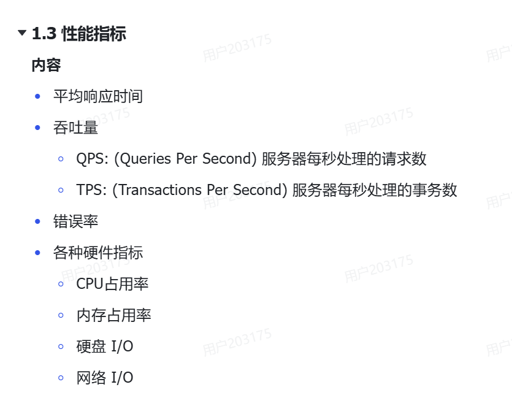
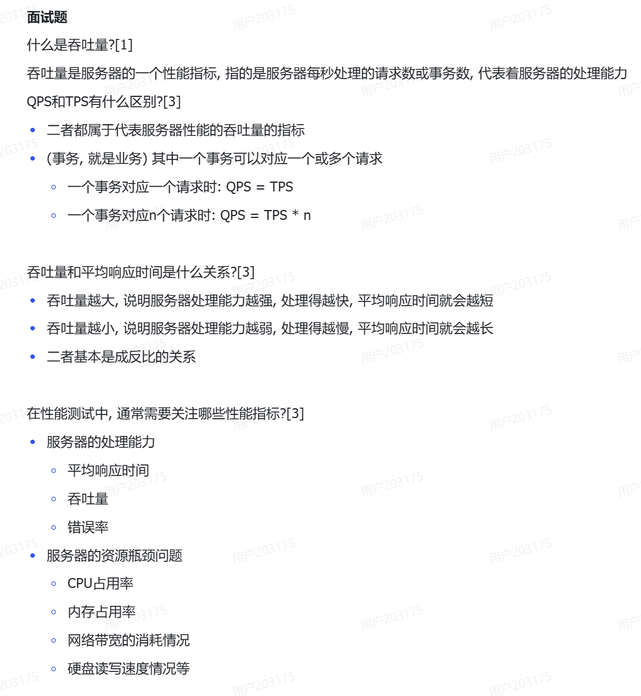
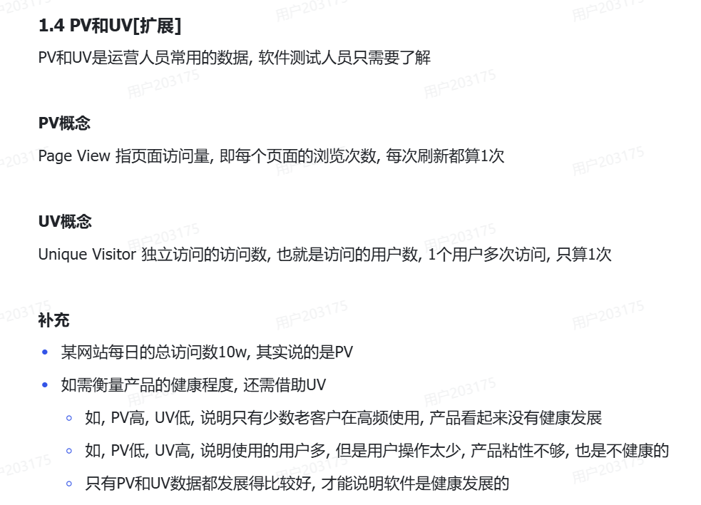
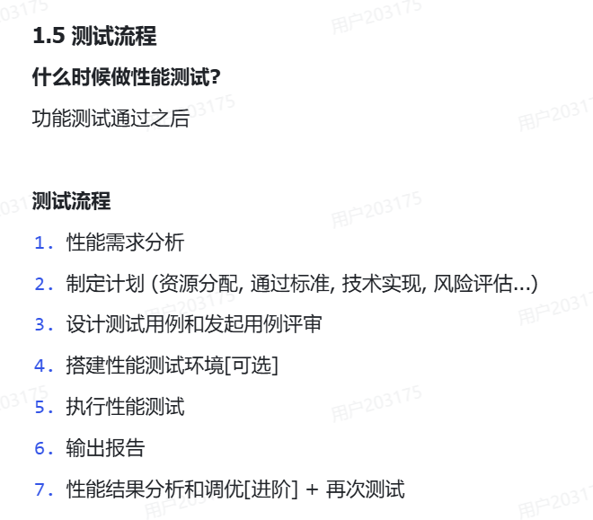

## 1.2 性能需求
### 高并发和高频率
高并发指的是大量用户在==同一时间点==的访问
高频率指的是大量用户在==同一时间段内==的访问

### 练习题
📊业务处理时间与量
系统每年业务集中在8个月完成，每个月平均20个工作日，每个工作日8小时。
去年全年处理业务约100万笔。

📋不同业务的请求次数
15%的业务处理中，每笔业务需对应用服务器提交7次请求。
70%的业务处理中，每笔业务需对应用服务器提交5次请求。
剩余15%的业务处理中，每笔业务需对应用服务器提交3次请求。

📈业务增长与测试计算
根据以往统计，每年业务增长量为15%。
考虑今后3年业务发展，测试需按现有业务量的两倍计算。

🔢每年总请求数计算
==计算公式：=(请求数×80％)/(总时间×20％)==
请求次数:(100万×15%×7 + 100万×70%×5 + 100万×15%×3)×2 = 1000万。
总时间:8×20×8×3600=4608000
(10000000×0.8)/(4608000×0.2)=8.680555556(向上取整) ＝9
也就是说 系统需要每秒处理9个请求就可以了

## 1.3性能指标

## 1.4 PV和UV 

## 1.5 测试流程
