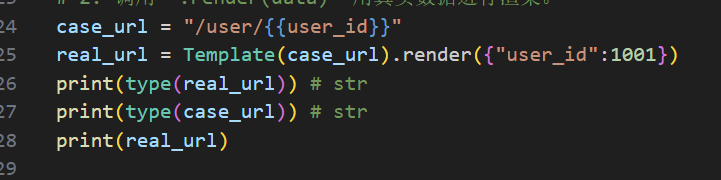
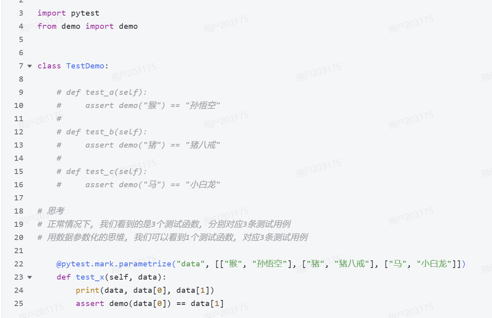
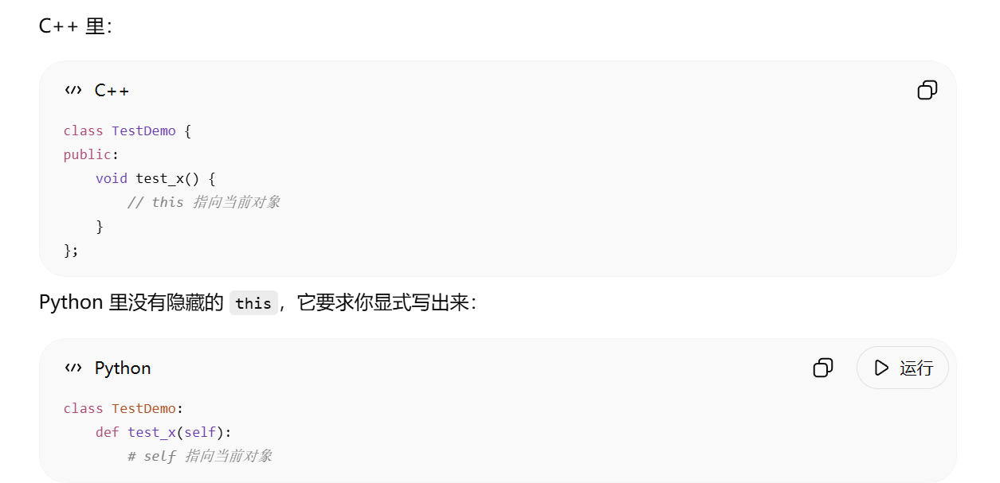
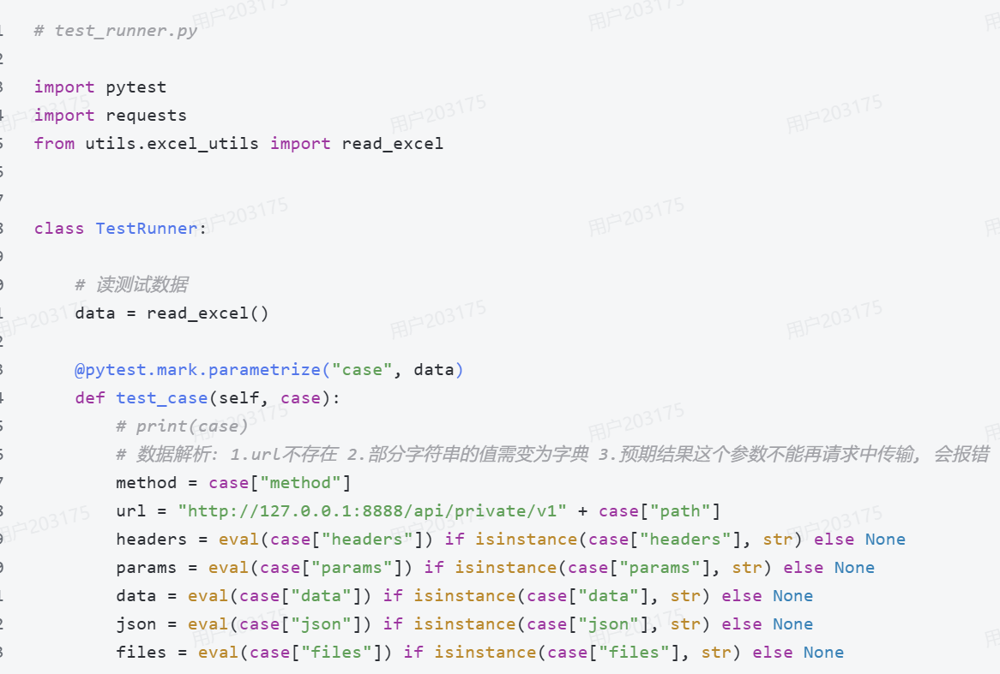

#### 参数化小结
url, 是请求地址​
params, 用于提交键值对数据, 在请求行提交, 适用于get和delete请求​
data, 用于提交键值对数据, 在请求体提交, 适用于post和put请求​
json, 用于提交JSON数据, 在请求体提交, 适用于post和put请求​
以请求方式的角度总结​
	get和delete, 用params提交请求数据​
	post和put, 用data来提交键值对格式数据, 用json来提交JSON格式数据​

#### 5.8 路径参数处理
路径参数和 url 参数本质上都是在 url 中包含参数，但是写法和 `requests` 中的传参方式不同。

url 参数的形式一般是：
```txt
/路径?a=x&b=xx
```
在 `requests` 中通常使用 `params` 来传参。

路径参数的形式一般是：
```txt
/xx/参数
/xx/{参数}
```
在 `requests` 中通常直接拼接或渲染到 url 里传参。

路径参数不一定必须动态获取，取决于参数的业务含义：

- 如果路径参数是固定资源，或者测试前就已知的数据，可以直接写死或放在测试数据文件里。例如 `/goods/1001`，只要 `1001` 在测试环境中长期存在，就可以直接配置。
- 如果路径参数依赖上游接口创建或返回，就必须动态获取。例如新增用户接口返回 `user_id`，后续修改用户、删除用户接口需要 `/users/{user_id}`，这时就要先从上一个接口响应中提取 `user_id`。

自动化框架中常见做法是使用模板渲染：
```txt
url: /users/{{ user_id }}
```
执行时先从全局变量池中取出 `user_id`，渲染后变成：
```txt
/users/12345
```

所以截图里说“参数所需的值，请务必在之前的请求中提取出来”，更准确地理解是：如果这个路径参数是上下游关联数据，就必须从之前请求中提取；如果是稳定固定数据，可以直接配置。

#### 5.7 引用全局变量 render() 模板渲染逻辑
`render()` 的作用是：把模板字符串里的占位符替换成真实数据，生成最终字符串。

示例：
```python
from jinja2 import Template

data = {"name": "zhangsan"}
t = Template("my name is {{name}}")
result = t.render(data)

print(result)
```

输出结果：
```txt
my name is zhangsan
```

运行步骤：

1. 创建模板对象。

```python
t = Template("my name is {{name}}")
```

这一步 Jinja2 会识别字符串里哪些是普通文本，哪些是模板变量。

```txt
普通文本：my name is
变量名：name
```

2. 调用 `render(data)`。

```python
t.render(data)
```

这一步会把字典 `data` 传给模板。

```python
data = {"name": "zhangsan"}
```

3. 查找变量。

模板里需要 `name`：
```txt
{{name}}
```

Jinja2 就会去 `data` 里面找 key 为 `name` 的值：
```python
data["name"]
```

找到的值是：
```txt
zhangsan
```

4. 替换变量。

把模板里的：
```txt
{{name}}
```

替换成：
```txt
zhangsan
```

5. 返回最终字符串。

最终返回：
```txt
my name is zhangsan
```

整体逻辑：
```txt
模板字符串 + 数据字典
        ↓
找到 {{变量名}}
        ↓
从字典中取同名 key 的值
        ↓
替换占位符
        ↓
得到最终字符串
```

在接口自动化中，`render()` 常用来处理 Excel 用例里的动态数据。例如：
```python
data = {
    "token": "abc123",
    "user_id": 1001
}

url = Template("/users/{{user_id}}").render(data)
headers = Template('{"Authorization": "Bearer {{token}}"}').render(data)
```

渲染结果：
```python
url = "/users/1001"
headers = '{"Authorization": "Bearer abc123"}'
```

一句话总结：`render()` 就是用字典里的真实值，把模板里的变量占位符填上。

#### 5.7 引用全局变量 测试用例里的 {{}} 什么时候会生效
测试用例里写的 `{{}}`，一开始本质上只是普通字符串，不会自动替换。

例如：
```python
case_url = "/users/{{ user_id }}"
print(case_url)
```

输出结果仍然是：
```txt
/users/{{ user_id }}
```

因为这时候它只是一个普通字符串，还没有经过模板渲染。

只有当这段字符串被当成 Jinja2 模板，并调用了 `render()` 之后，`{{}}` 才会生效。

例如：
```python
from jinja2 import Template

case_url = "/users/{{ user_id }}"
real_url = Template(case_url).render({"user_id": 1001})

print(real_url)
```

输出结果：
```txt
/users/1001
```

所以关键不在于它是不是字符串，而在于后面有没有经过这两步：

1. 用 `Template(...)` 把字符串包装成模板对象。
2. 调用 `.render(data)` 用真实数据进行渲染。

在接口自动化中的实际运行逻辑通常是：

1. Excel 里写测试数据，例如：
```txt
/users/{{ user_id }}
```
2. 框架读取 Excel 后，拿到的仍然只是普通字符串。
3. 发请求之前，框架会把这个字符串交给 `Template(...).render(全局变量池)`。
4. 如果全局变量池里有 `user_id`，就会替换成功。
5. 替换后的真实 url 再拿去发请求。

例如：
```python
all_var = {"user_id": 1001}
case_url = "/users/{{ user_id }}"
url = Template(case_url).render(all_var)
```

最终 `url` 的值就是：
```txt
/users/1001
```

一句话总结：Excel 里的 `{{变量名}}` 在刚读出来时只是字符串，只有经过 `Template(...).render(...)` 之后，才会真正变成引用后的真实值。

#### 5.7 引用全局变量——case 是字典时，为什么要先转字符串再 render
有时候测试用例里的 `case` 不是普通字符串，而是一个字典。

例如：
```python
case = {
    "url": "/users/{{user_id}}",
    "headers": {"token": "{{token}}"}
}
```

全局变量池：
```python
all_var = {
    "user_id": 1001,
    "token": "abc123"
}
```

这里的目标是：把 `case` 里的动态变量先渲染掉，再把结果继续当成字典使用。

有些代码会这样写：
```python
case = eval(Template(str(case)).render(all_var))
```

它的运行逻辑是：

1. `str(case)`
把字典转成字符串：
```python
"{'url': '/users/{{user_id}}', 'headers': {'token': '{{token}}'}}"
```

2. `Template(...).render(all_var)`
把字符串里的 `{{user_id}}` 和 `{{token}}` 替换掉：
```python
"{'url': '/users/1001', 'headers': {'token': 'abc123'}}"
```

3. `eval(...)`
再把这个看起来像字典的字符串转回真正的字典：
```python
{
    "url": "/users/1001",
    "headers": {"token": "abc123"}
}
```

所以这样操作的原因是：

- `Template()` 只能处理字符串，不能直接处理字典。
- `case` 如果是字典，就要先转成字符串。
- 渲染后的结果还是字符串。
- 如果后面还想按字典方式取值，就要再转回字典。

这种写法能用，但是 `eval()` 不够安全，也不够规范。

更稳一点的写法一：用 `ast.literal_eval()`
```python
import ast
from jinja2 import Template

case = ast.literal_eval(
    Template(str(case)).render(all_var)
)
```

它比 `eval()` 更安全，适合这种“字符串转字典”的场景。

更推荐的写法二：用 `json.dumps()` 和 `json.loads()`
```python
import json
from jinja2 import Template

case_str = json.dumps(case, ensure_ascii=False)
case = json.loads(Template(case_str).render(all_var))
```

它的好处是：

- `json.dumps()` 是标准序列化。
- `json.loads()` 是标准反序列化。
- 不依赖 Python 字典字符串格式。
- 可读性更好。

如果想写得更紧凑，也可以直接写成一行：
```python
case = json.loads(Template(json.dumps(case, ensure_ascii=False)).render(all_var))
```

结论：

- `Template()` 只能处理字符串。
- 所以字典类型的 `case` 要先转字符串。
- 渲染后如果还要当字典用，就要再转回来。
- 不建议用 `eval()`，更推荐 `ast.literal_eval()` 或 `json.loads()`。


#### 5.7 引用全局变量——case_url 和 case 的区别


有时候容易把 `case_url` 和 `case` 这两个变量混在一起，其实它们类型可能完全不同。

例如：
```python
case_url = "/user/{{user_id}}"
```

这里的 `case_url` 本来就是字符串类型：
```python
print(type(case_url))
```

输出：
```txt
<class 'str'>
```

原因很简单，因为右边本身就是一个字符串字面量。它不会因为里面写了 `{{user_id}}`，就自动变成字典。

这里的 ==`{{}}` 只是字符串中的一部分内容==，只有交给 Jinja2 处理时，才会被识别成模板变量。

例如：
```python
from jinja2 import Template

case_url = "/user/{{user_id}}"
real_url = Template(case_url).render({"user_id": 1001})

print(type(case_url))
print(type(real_url))
print(real_url)
```

结果是：
```txt
<class 'str'>
<class 'str'>
/user/1001
```

所以这段代码的类型变化是：
```txt
str -> Template对象 -> str
```

不是：
```txt
dict -> str -> render
```

只有在下面这种场景里，才会涉及“字典先转字符串再 render”：
```python
case = {
    "url": "/user/{{user_id}}",
    "headers": {"token": "{{token}}"}
}
```

这时候：

- `case_url` 是单个字段，本来就是字符串。
- `case` 是整个测试用例，本来是字典。

如果要对整个 `case` 做模板渲染，由于 `Template()` 不能直接处理字典，所以才需要：

1. 先把 `case` 转成字符串。
2. 再调用 `render()` 渲染。
3. 最后把结果转回字典。

所以可以这样记：

```python
case_url = "/user/{{user_id}}"                # 单个字段，字符串
case = {"url": "/user/{{user_id}}"}           # 整个用例，字典
```

结论：

- `case_url` 本来就是字符串，可以直接 `Template(case_url).render(...)`。
- `case` 如果是整个字典，才需要先转字符串，再渲染，再转回字典。

#### 4.13 数据源的处理——eval() 是什么
`eval()` 是 Python 的一个内置函数，作用是：把一个字符串，当成 Python 表达式去执行，然后返回结果。

例如：
```python
print(eval("1 + 2"))
```

输出结果：
```txt
3
```

因为字符串 `"1 + 2"` 被 Python 当成代码执行了。

再例如：
```python
print(eval("{'name': 'zhangsan', 'age': 18}"))
```

输出结果：
```python
{'name': 'zhangsan', 'age': 18}
```

这里它把这个字符串：
```python
"{'name': 'zhangsan', 'age': 18}"
```

当成了一个 Python 字典表达式来执行，所以最终返回真正的 `dict`。

这也是为什么在前面的代码中会出现：
```python
case = eval(Template(str(case)).render(all_var))
```

因为它做的是这几步：

1. `str(case)`：先把字典转成字符串。
2. `render(...)`：把字符串里的 `{{}}` 替换掉。
3. `eval(...)`：再把“长得像字典的字符串”转回真正的字典。

例如：
```python
s = "{'url': '/user/1001', 'token': 'abc'}"
d = eval(s)

print(d)
print(type(d))
```

结果：
```python
{'url': '/user/1001', 'token': 'abc'}
<class 'dict'>
```

但是 `eval()` 有一个明显问题：不安全。

因为它会真的执行字符串里的代码，而不是只做简单的数据转换。

例如：
```python
eval("__import__('os').system('dir')")
```

这种字符串也可能被执行，所以只要字符串来源不可靠，就有风险。

所以在“字符串转字典”这种场景里，更推荐：

1. 使用 `ast.literal_eval()`
```python
import ast

data = ast.literal_eval("{'name': 'zhangsan'}")
```

2. 如果是标准 JSON 字符串，就使用 `json.loads()`
```python
import json

data = json.loads('{"name": "zhangsan"}')
```

三者区别可以这样记：

- `eval()`：什么 Python 表达式都敢执行，功能强，但是危险。
- `ast.literal_eval()`：只解析字面量，例如字符串、数字、列表、字典，安全很多。
- `json.loads()`：专门解析 JSON 字符串，更规范。

一句话总结：`eval()` 就是把字符串当成 Python 代码去运行，并返回运行结果。

#### 请求参数解析
重要参数​
method 请求方式​
url 地址​
params 请求行的键值对传参​
data 请求体的键值对传参​
json 请求体的JSON格式传参​
files 用于文件上传​
headers 请求头​
cookies 保存的用户信息 (很少使用)​
verify 用于https请求, 简单粗暴的用法是 verify=False, 可以关闭证书认证 (很少使用)​
cert 用于https请求, 如果未关闭证书认证, 可以在此传SSL证书信息 (很少使用)

### 代码解析
#### test_runner.py 
文件路径：
`D:\测试开发\1.基础\jkzdh5.7\testcases\test_runner.py`

这个文件的核心作用是：

1. 读取 Excel 测试用例。
2. 用全局变量池渲染当前用例里的动态参数。
3. 发起 HTTP 请求。
4. 做 HTTP 断言和数据库断言。
5. 从响应结果或数据库中提取数据，保存给后续用例继续使用。

##### 逐行注释版
```python
import jsonpath  # 用来从 JSON 响应中按 jsonpath 表达式提取数据
import pymysql  # 用来连接 MySQL 数据库，做数据库断言或数据库提取
import pytest  # 用来驱动测试执行，支持参数化
import requests  # 用来发 HTTP 请求
from jinja2 import Template  # 用来做模板渲染，例如把 {{user_id}} 渲染成真实值
from utils.excel_utils import read_excel  # 导入读取 Excel 用例的工具函数


class TestRunner:

    data = read_excel()  # 类加载时读取 Excel 中的全部测试用例，得到一个列表

    all = {}  # 定义全局变量池，用来保存提取出的 token、user_id 等数据

    @pytest.mark.parametrize("case", data)  # 把 data 里的每一条用例，依次传给 case
    def test_case(self, case):

        all = self.all  # 引用类属性 all，后面操作的就是同一个全局变量池

        case = eval(Template(str(case)).render(all))  # 先把 case 转字符串，再渲染 {{}}，最后转回字典

        method = case["method"]  # 读取请求方法，例如 GET、POST
        url = "http://192.168.10.131:8888/api/private/v1" + case["path"]  # 拼接完整请求地址
        hearders = eval(case["headers"]) if isinstance(case["headers"], str) else None  # 解析请求头字符串为字典
        params = eval(case["params"]) if isinstance(case["params"], str) else None  # 解析 params 参数
        data = eval(case["data"]) if isinstance(case["data"], str) else None  # 解析 data 参数
        json = eval(case["json"]) if isinstance(case["json"], str) else None  # 解析 json 参数
        files = eval(case["files"]) if isinstance(case["files"], str) else None  # 解析 files 参数

        request_data = {  # 把解析出来的请求数据统一打包，方便后面直接解包发请求
            "method": method,
            "url": url,
            "headers": hearders,
            "params": params,
            "data": data,
            "json": json,
            "files": files,
        }

        res = requests.request(**request_data)  # 发起 HTTP 请求，得到响应对象
        print(res.json())  # 打印响应 JSON，方便调试

        if case["check"]:  # 如果配置了 jsonpath 断言规则
            assert jsonpath.jsonpath(res.json(), case["check"])[0] == case["expected"]  # 提取后与预期值比较
        else:
            assert case["expected"] in res.text  # 否则做文本包含断言

        if case["sql_check"] and case["sql_expected"]:  # 如果配置了数据库断言
            conn = pymysql.Connect(  # 连接数据库
                host="192.168.10.131",
                port=3306,
                database="mydb",
                user="root",
                password="123456",
                charset="utf8"
            )
            cur = conn.cursor()  # 创建游标
            cur.execute(case["sql_check"])  # 执行断言 SQL
            result = cur.fetchone()  # 获取一条查询结果
            cur.close()  # 关闭游标
            conn.close()  # 关闭连接
            assert result[0] == case["sql_expected"]  # 把查询结果的第一列与预期值比较

        if case["jsonExData"]:  # 如果配置了 JSON 提取规则
            for key, value in eval(case["jsonExData"]).items():  # 把提取规则字符串转字典，再逐项遍历
                value = jsonpath.jsonpath(res.json(), value)[0]  # 从响应 JSON 里提取真实值
                all[key] = value  # 放进全局变量池，供后续用例使用

        if case["sqlExData"]:  # 如果配置了数据库提取规则
            for key, value in eval(case["sqlExData"]).items():  # value 这里通常是一条 SQL 语句
                conn = pymysql.Connect(  # 再次连接数据库
                    host="192.168.10.131",
                    port=3306,
                    database="mydb",
                    user="root",
                    password="123456",
                    charset="utf8"
                )
                cur = conn.cursor()  # 创建游标
                cur.execute(value)  # 执行提取 SQL
                result = cur.fetchone()  # 获取一条结果
                cur.close()  # 关闭游标
                conn.close()  # 关闭连接
                value = result[0]  # 取查询结果第一列
                all[key] = value  # 放进全局变量池，给后续用例继续引用
```

##### 代码执行流程
每跑一条用例，整体逻辑就是：

1. `pytest` 从 `data` 中取出一条 Excel 用例，传给 `case`。
2. 用 `all` 变量池对当前 `case` 做模板渲染，把 `{{token}}`、`{{user_id}}` 这类占位符替换成真实值。
3. 从渲染后的 `case` 中解析出 `method`、`url`、`headers`、`params`、`data`、`json`、`files`。
4. 调用 `requests.request(**request_data)` 发起 HTTP 请求。
5. 如果配置了 `check`，就做 JSONPath 断言；否则做文本包含断言。
6. 如果配置了 `sql_check` 和 `sql_expected`，就去数据库执行 SQL，再做数据库断言。
7. 如果配置了 `jsonExData`，就从响应 JSON 中提取数据，放进 `all`。
8. 如果配置了 `sqlExData`，就从数据库提取数据，放进 `all`。
9. 后续用例再次运行时，就可以通过 `{{变量名}}` 从 `all` 中取值。

##### 关键点理解
`data = read_excel()`
表示把 Excel 中的全部测试用例先读出来，后面参数化执行时会一条一条跑。

`all = {}`
表示初始化一个全局变量池，用来保存提取结果。这个变量池是用例关联的核心。

`@pytest.mark.parametrize("case", data)`
表示把 Excel 中的每一条用例依次传给测试函数。

`all = self.all`
表示把类属性里的全局变量池拿到当前函数里继续用。这里不是复制，而是引用同一个字典对象。

`case = eval(Template(str(case)).render(all))`
这是最核心的一行，作用是：

1. `str(case)`：先把字典形式的用例转成字符串。
2. `Template(...).render(all)`：把字符串中的 `{{}}` 渲染成真实值。
3. `eval(...)`：把渲染后的字符串再转回字典。

例如：
```python
case = {
    "path": "/users/{{user_id}}"
}
all = {
    "user_id": 1001
}
```

渲染后就会变成：
```python
{
    "path": "/users/1001"
}
```

`request_data = {...}`
表示把请求参数统一收口，后面直接交给 `requests.request()`。

`res = requests.request(**request_data)`
表示真正发请求。`**request_data` 的意思是把字典展开成关键字参数。

`jsonpath.jsonpath(res.json(), case["check"])[0]`
表示按 JSONPath 表达式从响应里提取值，再做精确断言。

`all[key] = value`
表示把提取出来的值保存到全局变量池，例如保存 `token`、`user_id`，让后面的接口继续复用。

##### 这份代码里需要特别注意的地方
- `eval()` 用得很多，能跑，但是不安全。更推荐 `ast.literal_eval()` 或 `json.loads()`。
- `all` 这个变量名会和 Python 内置函数 `all()` 重名，不太规范。
- `hearders` 是拼写错误，标准写法应该是 `headers`。这里只是因为前后一直都用同一个变量名，所以暂时不影响运行。
- `json` 被当成变量名使用，也不太推荐，因为容易和 `json` 模块重名。
- 数据库连接在多个地方重复创建，后续更适合提取成数据库工具函数，或者放到夹具里统一管理。
- `base_url` 和数据库配置目前都是硬编码，后续更适合抽到配置文件中。

#### 1.zip() 
##### 场景代码

把多个可迭代对象，按位置一一配对，打包成一组一组的数据。
所以 keys = [cell.value for cell in worksheet[2]] 这段代码的意思是 
拿 Excel 第 2 行作为字典的 key，也就是表头。
从第 3 行开始，一行一行读取 Excel 里面的真实测试数据。
比如某一行是：[1, "/login", "POST", "登录成功"]
然后 dict_data = dict(zip(keys, row))
把表头和这一行数据合并成一个字典：
```txt
{    "用例编号": 1,    "接口地址": "/login",    "请求方法": "POST",    "预期结果": "登录成功"}
```
把 key 列表和值列表，合成一个字典。
`zip()` 如果两边长度不一样，会按短的来。
	key的数量是3个 但是value的数量是2个的话 zip只执行2个

`zip()` 是用来 **按位置打包配对** 的；`dict(zip(keys, row))` 是用来 **把表头和一行数据组合成字典** 的。
#### 2.self
##### 场景代码

这里的 `self` 可以先把它理解成：**当前这个测试类对象本身**。

Python 类方法默认要写的参数，代表当前这个 `TestDemo` 对象。
data才是 pytest 参数化传进来的测试数据。

类比 C++ 里的 `this` 指针。

写在 class 里面的函数，第一个参数通常要写 self；pytest 的参数化数据从第二个参数开始接。

#### 3.@pytest.mark.parametrize("case", data)
##### 场景代码

可以理解为 @pytest.mark.parametrize(参数名, 数据源) 
"case" 负责接收数据 data 负责提供数据
含义是：
> pytest 会从 `data` 里面一条一条取数据，然后传给测试函数里的 `case` 这个参数。

装饰器里面写的是字符串 "case"
函数里面写的是变量名：case
由于前面写了：
```
data = read_excel()
```
所以 `data` 是从 Excel 里面读出来的所有测试用例。
