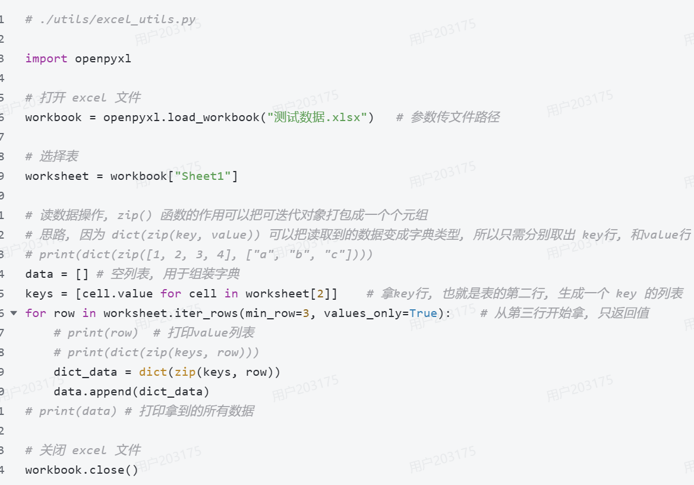

#### 参数化小结
url, 是请求地址​
params, 用于提交键值对数据, 在请求行提交, 适用于get和delete请求​
data, 用于提交键值对数据, 在请求体提交, 适用于post和put请求​
json, 用于提交JSON数据, 在请求体提交, 适用于post和put请求​
以请求方式的角度总结​
	get和delete, 用params提交请求数据​
	post和put, 用data来提交键值对格式数据, 用json来提交JSON格式数据​
#### 请求参数解析
重要参数​
method 请求方式​
url 地址​
params 请求行的键值对传参​
data 请求体的键值对传参​
json 请求体的JSON格式传参​
files 用于文件上传​
headers 请求头​
cookies 保存的用户信息 (很少使用)​
verify 用于https请求, 简单粗暴的用法是 verify=False, 可以关闭证书认证 (很少使用)​
cert 用于https请求, 如果未关闭证书认证, 可以在此传SSL证书信息 (很少使用)

### 函数解析
#### 1.zip() 
##### 场景代码

把多个可迭代对象，按位置一一配对，打包成一组一组的数据。
所以 keys = [cell.value for cell in worksheet[2]] 这段代码的意思是 
拿 Excel 第 2 行作为字典的 key，也就是表头。
从第 3 行开始，一行一行读取 Excel 里面的真实测试数据。
比如某一行是：[1, "/login", "POST", "登录成功"]
然后 dict_data = dict(zip(keys, row))