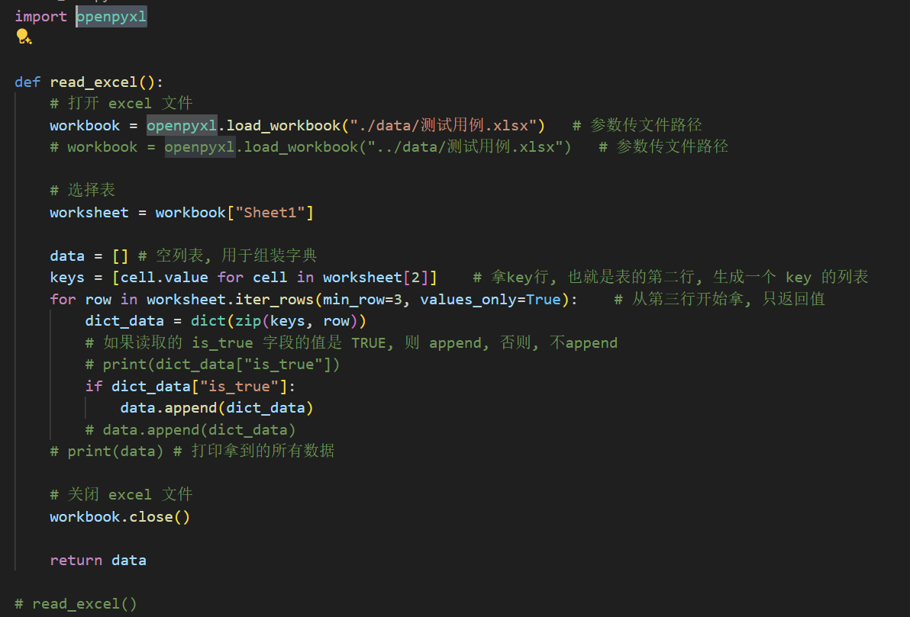

# Excel 读取结果为什么常用 `列表[字典]`

在自动化框架的 `utils` 层里，读取 Excel 测试数据时，常见写法是：

```python
data = []
for row in worksheet.iter_rows(min_row=3, values_only=True):
    dict_data = dict(zip(keys, row))
    if dict_data["is_true"]:
        data.append(dict_data)
```

这里不是“多此一举”，而是因为 Excel 通常有多行数据，每一行都表示一条测试记录。

## 1. 为什么要用列表装字典

- `dict_data` 表示一行数据
- `data` 表示所有行数据

也就是说：

```python
dict_data = {"case_id": 1, "title": "登录成功", "is_true": True}
```

只是一条数据。

而：

```python
data = [
    {"case_id": 1, "title": "登录成功", "is_true": True},
    {"case_id": 2, "title": "登录失败", "is_true": True},
]
```

表示多条测试数据。

所以，`列表 + 字典` 的组合，本质上是在表达：

- 列表：存放多条记录
- 字典：描述一条记录里的字段和值

## 2. 为什么不能直接只用一个字典

如果直接写成一个字典：

```python
data = {"case_id": 1, "title": "登录成功", "is_true": True}
```

那么它只能表示一行数据。

如果后面继续读取下一行，再赋值给 `data`，前一行就会被覆盖，没法自然地保存多条 Excel 记录。

## 3. 什么情况下可以直接用字典

可以，但前提是你的业务本来就只需要：

- 一条数据
- 或者按唯一键组织多条数据

例如用用例 id 作为 key：

```python
data = {}
for row in worksheet.iter_rows(min_row=3, values_only=True):
    dict_data = dict(zip(keys, row))
    if dict_data["is_true"]:
        data[dict_data["case_id"]] = dict_data
```

这样得到的是：

```python
{
    1: {"case_id": 1, "title": "登录成功", "is_true": True},
    2: {"case_id": 2, "title": "登录失败", "is_true": True}
}
```

这种写法适合：

- 需要通过 `case_id` 快速查某条数据
- 能保证 key 唯一

但如果只是按顺序遍历 Excel 用例，`列表[字典]` 更直观，也更常见。

## 4. 在自动化框架里的理解

在 `utils` 层读取 Excel，通常目标不是“只拿一条值”，而是“把多条测试用例整理成程序能直接消费的数据结构”。

因此推荐理解为：

- Excel 一行 = 一个字典
- Excel 多行 = 一个列表

最终返回 `list[dict]`，后续在用例执行层里遍历即可：

```python
for case in data:
    print(case["title"])
```

## 5. 一句话总结

读取 Excel 多行测试数据时，常用 `列表套字典`，因为：

- 字典适合表示“一条记录”
- 列表适合表示“多条记录”

所以自动化框架里返回 `list[dict]`，是最符合测试数据场景的结构。
