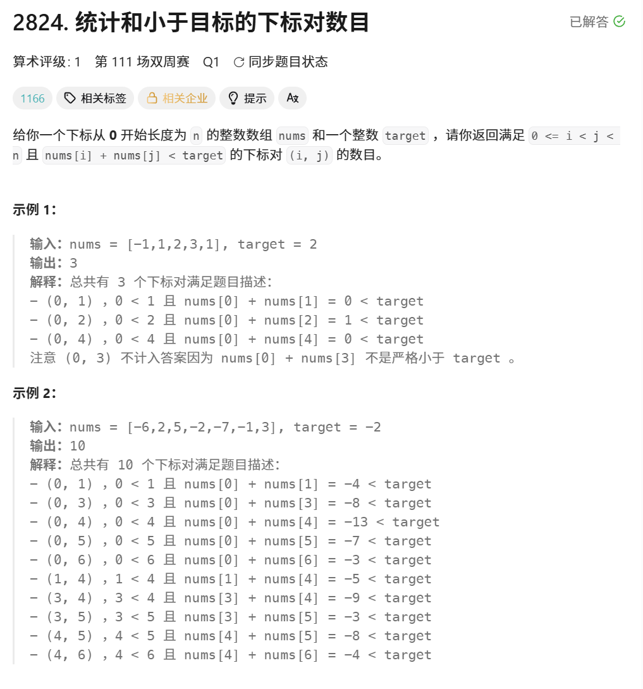
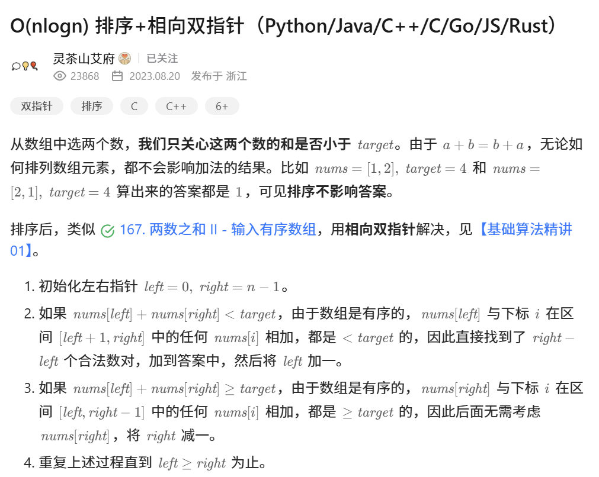

#### 题目

#### 题解

#### LeetCode代码
```C++
class Solution {
public:
    int countPairs(vector<int>& nums, int target) {
        //从大到小排序
        sort(nums.begin(),nums.end());
        //最小为left
        int left = 0;
        //最大为right
        int right = nums.size()-1;
        int ans = 0;
        while(left<right){
            int sum = nums[left]+nums[right];
            if(sum<target){
                ans += right - left;
                left++;
            }
            else
            {
                right--;
            }
        }
        return ans;
    }
};
```