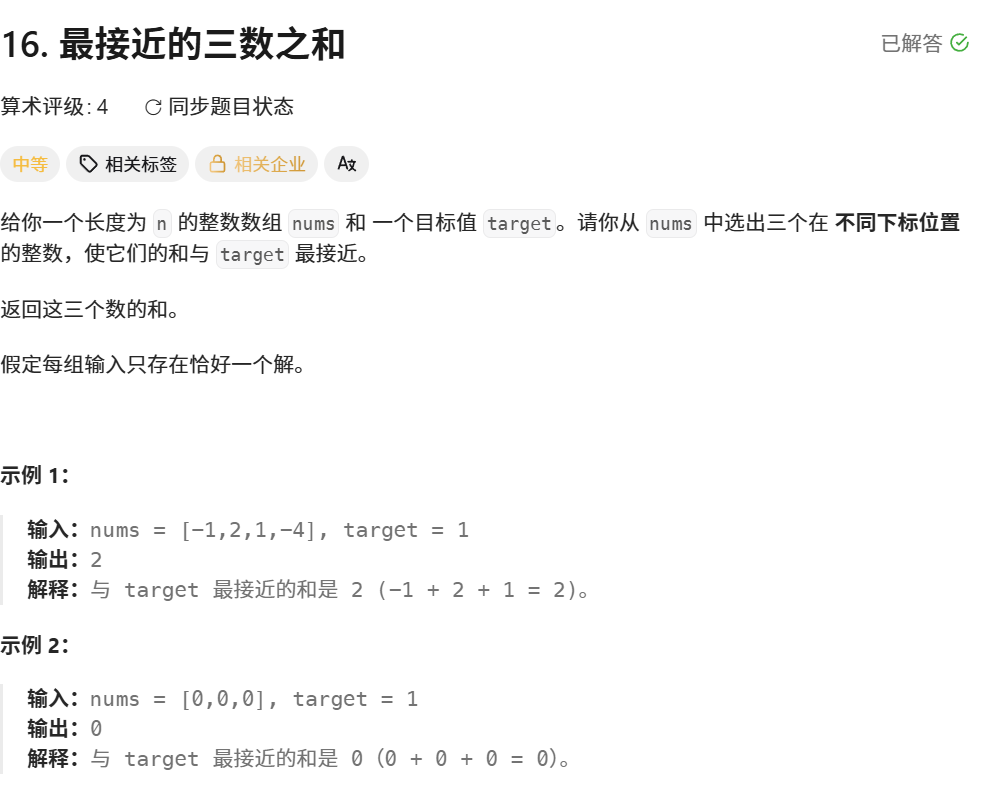
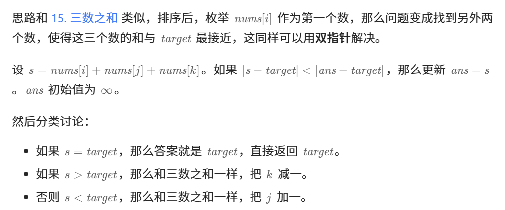

#### 题目

#### 题解
最接近三数之和 先要确定的是 最终要返回的值是一个数的绝对值 因为是最接近的 不是纯大小 可以先固定一个`i` 然后剩下两个用相向指针 `j`,`k` k是数组的最后一个元素 j是i+1 先给数组排完序 使用sort函数 然后因为i是固定用for去进行自增遍历的 又因为他是从小到大排好序的 所以j跟k的自增自减条件可以 根据i来做判断 
然后进行分类讨论


#### LeetCode代码
```cpp
class Solution {
public:
    int threeSumClosest(vector<int>& nums, int target) {
        sort(nums.begin(),nums.end());
        int n = nums.size();
        int ans = nums[0]+nums[1]+nums[2];
        for(int i = 0;i<n-2;i++){
            int j = i+1;
            int k = n-1;
            while(j<k){
                int sum = nums[i]+nums[j]+nums[k];
                if(abs(sum-target)<abs(ans-target)){
                    ans = sum;
                }
                if(sum==target){
                    return target;
                }else if(sum <target){
                    j++;
                }else{
                    k--;
                }
            }
        }
        return ans ;
    }
};
```
### ACM模式代码
```cpp
#include<iostream>
#include<vector>
#include<algorithm>
using namespace std;

int main() {
	int n;
	cin >> n;
	int target = 0;
	vector<int>nums(n);
	for (int x = 0; x < n; x++) {
		cin >> nums[x];
	}
	cin >> target;
	//当小于3的时候 直接返回
	if (n < 3) {
		return 0;
	}
	sort(nums.begin(), nums.end());
	int ans = nums[0] + nums[1] + nums[2];
	//i,j,k i<j<k
	for (int i = 0; i < n - 2; i++) {
		int j = i + 1;
		int k = n - 1;
		
		while (j < k) {
			//绝对值做位置判断 最接近 无所谓正负数
			int sum = nums[i] + nums[j] + nums[k];
			if (abs(sum - target) < abs(ans - target)) {
				ans = sum;
			}
			if (sum == target)
			{
				cout << target << endl;
				return 0;
			}
			else if (sum < target)
			{
				j++;
			}
			else
			{
				k--;
			}
		}
	}
	cout << ans << endl;
	return 0;
}
```
#### 错误总结
###### 问题
###### 三数之和最接近：本次错误点整理

题目类型：排序 + 双指针  
目标：找到三个数之和，使其最接近 target。

---

###### 1. vector 创建位置错误

###### 错误写法

```cpp
int n = 0;
vector<int> nums(n);
cin >> n;
这时候 `n` 还是 0，所以创建出来的是一个空数组：

```
vector<int> nums(0);
```

后面再输入数据时，就会访问不存在的位置，导致：

```
vector subscript out of range
```

###### 正确写法

```
int n;​cin >> n;​vector<int> nums(n);
```

###### 记忆

先输入 `n`，再创建 `vector<int> nums(n)`。

---

##### 2. 输入数组时下标写错

###### 错误写法

```
for (int x = 0; x < n; x++) {​    cin >> nums[n];​}
```

###### 问题

`nums[n]` 是越界的。

如果数组长度是 `n`，合法下标是：

```
0 ~ n - 1
```

所以最后一个元素是：

```
nums[n - 1]
```

不是：

```
nums[n]
```

###### 正确写法

```
for (int x = 0; x < n; x++) {​    cin >> nums[x];​}
```

###### 记忆

循环变量是 `x`，就用：

```
nums[x]
```

不要写成：

```
nums[n]
```

---

##### 3. ans 初始化位置不应该放在 for 循环里面

###### 不推荐写法

```
for (int i = 0; i < n - 2; i++) {​    int ans = nums[0] + nums[1] + nums[2];​}
```

###### 问题

`ans` 是全局最优答案，应该保存整个搜索过程中的最接近结果。

如果放在 `for` 循环里面，每次 `i` 改变时都会重新初始化，前面找到的更优答案可能会丢失。

###### 正确写法

```
int ans = nums[0] + nums[1] + nums[2];​​for (int i = 0; i < n - 2; i++) {​    // 双指针搜索​}
```

###### 记忆

`ans` 是最终答案，要放在外面。

---

##### 4. sum 要放在 while 循环里面重新计算

###### 错误写法

```
int sum = nums[i] + nums[j] + nums[k];​​while (j < k) {​    if (sum < target) {​        j++;​    } else {​        k--;​    }​}
```

###### 问题

`j++` 或 `k--` 之后，指针位置变了，但是 `sum` 没有重新计算。

也就是说，程序一直拿旧的 `sum` 做判断，逻辑会错。

###### 正确写法

```
while (j < k) {​    int sum = nums[i] + nums[j] + nums[k];​​    if (sum < target) {​        j++;​    } else {​        k--;​    }​}
```

###### 记忆

双指针题里：

```
指针变了，sum 就要重新算。
```

---

##### 5. 判断最接近时，两边都要加 abs

###### 错误写法

```
if (abs(sum - target) < ans - target) {​    ans = sum;​}
```

###### 问题

`ans - target` 可能是负数。

比如：

```
sum - target = 2​ans - target = -5
```

如果不加 `abs`，比较的就不是“距离”，而是普通的正负数大小。

###### 正确写法

```
if (abs(sum - target) < abs(ans - target)) {​    ans = sum;​}
```

###### 记忆

最接近比较的是距离：

```
abs(当前和 - target) < abs(答案和 - target)
```

---

##### 6. sum == target 时要直接结束

###### 错误写法

```
if (sum == target) {​    cout << target << endl;​}
```

###### 问题

如果 `sum == target`，说明已经找到最接近的结果了。

因为距离是：

```
abs(sum - target) == 0
```

不可能有比 0 更小的距离。

但是如果只 `cout`，不 `return`，那么 `j` 和 `k` 都没有变化，可能会死循环。

###### 正确写法

```
if (sum == target) {​    cout << target << endl;​    return 0;​}
```

###### 记忆

等于 target，就是最优解，直接返回。

---

##### 7. else 的大括号不要写错

###### 错误写法

```
else if (sum < target)​{​    j++;​}​{​    k--;​}
```

###### 问题

后面的：

```
{​    k--;​}
```

不是 `else`，只是一个普通代码块。

它会无条件执行。

也就是说，即使前面执行了 `j++`，后面也会执行 `k--`。

###### 正确写法

```
else if (sum < target) {​    j++;​}​else {​    k--;​}
```

###### 记忆

双指针移动规则：

```
sum < target 说明和太小，j++​sum > target 说明和太大，k--
```

---

##### 8. main 函数里 return ans 不是输出答案

###### 错误写法

```
return ans;
```

###### 问题

在 `main` 函数里，`return ans` 只是把 `ans` 当作程序退出码返回给操作系统。

它不会正常显示到控制台。

###### 正确写法

```
cout << ans << endl;​return 0;
```

###### 记忆

算法题要输出结果，用：

```
cout << ans << endl;
```

程序正常结束，用：

```
return 0;
```

---

##### 9. n < 3 时可能越界

###### 有风险的写法

```
int ans = nums[0] + nums[1] + nums[2];
```

###### 问题

如果 `n < 3`，那么 `nums[2]` 不存在，会越界。

LeetCode 原题一般会保证 `n >= 3`，但是 ACM 写法最好自己判断一下。

###### 可以加上

```
if (n < 3) {​    return 0;​}
```